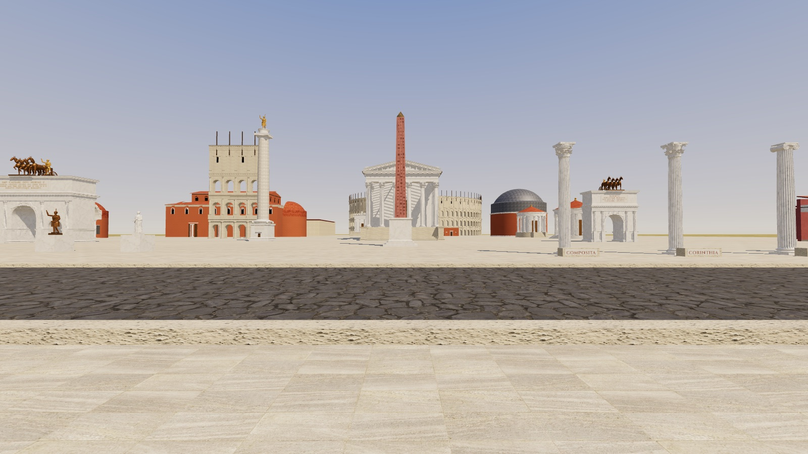
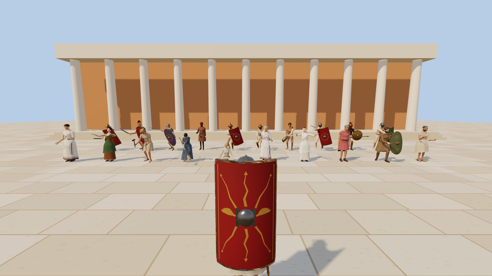
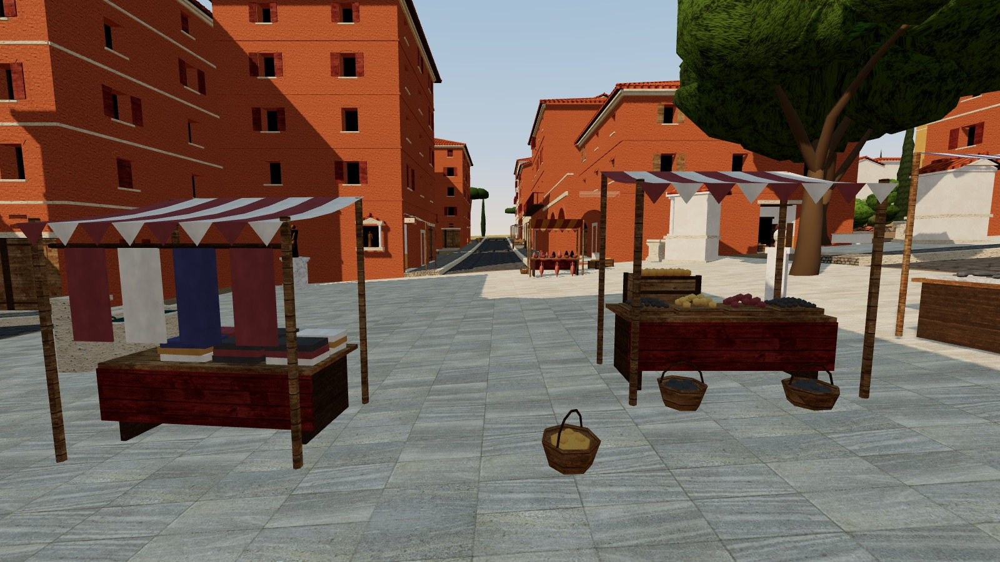
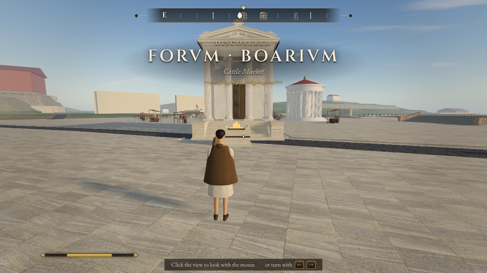

# Skyrome

**An open-world RPG set in Rome in May of AD 113, at the height of the empire under Trajan. It runs in your browser.**

It's built in the spirit of *Skyrim* and *Oblivion*: a city you can walk anywhere in, historical places you can visit, period quests, factions, street fights, gladiators and bosses. The fantasy is turned way down. There are no dragons or fireballs. The "supernatural" is limited to what a Roman would have believed: omens, curse tablets, mystery cults, and the ghost nights of the Lemuria. Nothing is ever clearly real.

The game opens at dawn on 11 May 113 at the Porta Capena. Trajan's Forum and Column have just been dedicated. The Pantheon is a construction site after the fire of 110. The emperor is preparing to leave for the Parthian war. You arrive with the last night cart, a courier is knifed beside you, and you're left holding his sealed tablet.



> **Status: pre-alpha.** You can start a game and walk around Rome, but there's no story to play through yet.
>
> **Working now:**
> - The boot flow: pick mouse, trackpad or keyboard; the title over the city; character creation; then you start at the Porta Capena before dawn on 11 May AD 113.
> - The terrain of the hills and valleys, and the Tiber as real water you can swim in.
> - The river district, fully built: the Forum Boarium, the Temples of Portunus and Hercules Victor, Tiber Island, the Theatre of Marcellus and every Tiber bridge.
> - The HUD: discovery banners, a Skyrim-style compass, quicksave.
>
> **In progress:** the landmarks of the Forum, the Imperial Fora, Trajan's Forum and Column, the Colosseum valley, the Palatine and Circus Maximus, and the Campus Martius (still placeholder blocks for now); the city fabric between them; combat; NPC crowds; the first quests.
>
> [Where things stand](#where-things-stand) has the full list.

## Screenshots

| | |
|---|---|
|  |  |
| *Procedural Romans: togas, stolas, legionaries, a Vestal, gladiator kits* | *City fabric: insulae, tabernae, stalls, umbrella pines* |
|  |  |
| *Title screen* | *The map, drawn from the historical atlas* |
|  |  |
| *Walking into the Forum Boarium: discovery banner, compass, health bar* | *First launch: pick how you play (the trackpad preset is built for MacBooks)* |

## Play it

**https://scootsmagoo.github.io/skyrome/**

The game opens straight into the Forum at mid-morning with a default character. There are no menus yet, and character creation is skipped while the game is being tested. Use desktop Chrome or Safari.

- **Look around:** click into the view to capture the mouse (or use the arrow keys). Esc releases it and pauses.
- **Move:** W A S D.
- **Fight:** F attacks (hold it for a power attack), Q blocks, R draws your sword.
- **Everything else:** see the controls below.

Every push to `main` redeploys the site, once the tests pass. Hard-refresh (Cmd+Shift+R) to get the latest build.

## Testing

### Quick links

| What | Link |
|---|---|
| The default start: the Forum at 10:00 | [scootsmagoo.github.io/skyrome](https://scootsmagoo.github.io/skyrome/) |
| **Boss fight: Nereus the retiarius** (net, trident, crowd favor, missio) | [`?fight=nereus`](https://scootsmagoo.github.io/skyrome/?fight=nereus) |
| Warm-up bout 1: Pullus, a nervous recruit | [`?fight=pullus`](https://scootsmagoo.github.io/skyrome/?fight=pullus) |
| Warm-up bout 2: Auctus, a thraex who hooks round your shield | [`?fight=auctus`](https://scootsmagoo.github.io/skyrome/?fight=auctus) |
| The Ludus Magnus on an ordinary day (no fight) | [`?at=ludus-magnus&hour=10`](https://scootsmagoo.github.io/skyrome/?at=ludus-magnus&hour=10) |
| The Colosseum at night | [`?at=colosseum&hour=22`](https://scootsmagoo.github.io/skyrome/?at=colosseum&hour=22) |
| The river district (the most finished part of the city) | [`?at=temple-portunus`](https://scootsmagoo.github.io/skyrome/?at=temple-portunus) |
| The Pantheon (a construction site after the fire of 110) | [`?at=pantheon`](https://scootsmagoo.github.io/skyrome/?at=pantheon) |
| The story start: the Porta Capena before dawn | [`?quick=1`](https://scootsmagoo.github.io/skyrome/?quick=1) |
| The full flow: control presets, title, character creation | [`?menu=1`](https://scootsmagoo.github.io/skyrome/?menu=1) |
| Show the welcome card again | [`?welcome=1`](https://scootsmagoo.github.io/skyrome/?welcome=1) |
| Performance overlay (fps, draw calls, CPU per system) | [`?debug`](https://scootsmagoo.github.io/skyrome/?debug) |

Options combine: `?at=` takes any landmark id (type `coc` in the console for the list), `&hour=` sets the hour (0–24) and `&origin=` the character's background (`civis-suburanus`, `hispanus`, `veteranus`, `dacus`).

### The console

Press **`** (the key left of 1) to open it, as in Skyrim. The game pauses while it's open. Enter runs a command, ↑ ↓ recall earlier ones, Tab completes, and ` or Esc closes it. Cheats last until you reload the page.

| Command | What it does |
|---|---|
| `tgm` | God mode: no damage, endless stamina (type it again to turn it off) |
| `tcl` | No-clip: fly through walls and floors (Space up, C down, Shift fast) |
| `coc <place>` | Teleport to a landmark: `coc ludus`, `coc colosseum`, `coc forum`. `coc` alone lists them all |
| `fight <name>` | Go to the Ludus and start a bout: `fight nereus`, `fight pullus`, `fight auctus` |
| `spawn <enemy> [n]` | Enemies in front of you: `spawn grassator 3` (street thugs), `tiro`, `thraex`, `vigil` |
| `kill` / `killall` | Kill whoever you're looking at / everyone fighting you |
| `heal` | Full health and stamina; cures poison, disease and injuries |
| `additem <item> [n]` | Add an item by id or name: `additem gladius`, `additem scutum`. `items` lists them |
| `gold <n>` | Add denarii |
| `sethour <h>` | Change the time of day (`set gamehour to 20` works too) |
| `clearbounty` | Wipe your bounty; the watch stands down |
| `difficulty <level>` | `tiro`, `facilis`, `normalis` (default), `difficilis`, `herculea` |
| `gore <level>` | `off`, `normal`, `ultra` |
| `tdo` | Performance overlay on/off |
| `pos` | Print where you are |
| `help` | Everything above, in the game |

### Things to try

- **Street fight:** from the default start, open the console, type `spawn grassator 3`, close it, press R to draw and F to swing. Add `tgm` first if you just want to watch the gore.
- **The law:** hit a passer-by. They flee or fight back, the watch comes, and you can pay, talk, bribe, go to jail or resist. `clearbounty` resets it.
- **The boss:** [`?fight=nereus`](https://scootsmagoo.github.io/skyrome/?fight=nereus). Sidestep when he twirls the net; if it catches you, mash F or E. Hold Q to block, tap it just before his blow lands to parry, then strike at once to riposte. Lost? Type `fight nereus` in the console for a rematch. Once you've beaten him the questline is finished, so reload the link to fight him again.
- **Getting around fast:** `tcl` and Shift to fly over the city, or `coc` to jump between landmarks.
- **Feel:** Esc → Settings → Gameplay has difficulty, gore, camera shake and hit-stop.

## Try it locally

You need Node 22 or newer.

```bash
npm install
npm run dev
```

Then open one of these scenes. Click into the game to look around and press Esc to release the mouse.

| Scene | URL | What it shows |
|---|---|---|
| The game | http://127.0.0.1:5173/ | Straight into the Forum at 10:00 with the default character. `?menu=1` gives the title over the city, character creation and the start at the Porta Capena before dawn on 11 May AD 113; `?quick=1` skips the menus there |
| The river district | http://127.0.0.1:5173/?scene=rome&at=temple-portunus | Drops you straight into Rome with no menus. The Forum Boarium, Tiber Island and the Theatre of Marcellus are fully built. `at=` takes any of the atlas's 208 landmark ids (e.g. `temple-aesculapius`, `theatre-marcellus`, `circus-maximus`, `column-trajan`, `pantheon`), but most landmarks outside the river district are still placeholder blocks |
| Characters | http://127.0.0.1:5173/?scene=avatars | Procedural Romans and gladiators with code-authored animation. You're a legionary: R draws your sword, F attacks, Q blocks |
| Architecture | http://127.0.0.1:5173/?scene=arch | The classical kit: orders, temples, arches, the amphitheatre arcade, the Column, domes, statues |
| Street | http://127.0.0.1:5173/?scene=fabric | A neighbourhood of insulae, shops, stalls, fountains and trees |
| Sky | http://127.0.0.1:5173/?scene=sky&timelapse=1 | A physically based sky and the sun and moon for AD 113 (try `&hour=23`, `&weather=rain`) |
| Interface | http://127.0.0.1:5173/?scene=ui&open=title | HUD and menus filled with sample data (`open=map`, `inventory`, `journal`, `dialogue`…) |
| Sound | http://127.0.0.1:5173/?scene=audio | Procedural sound effects, ambience, and generative music in the ancient modes |
| Landmark viewer | http://127.0.0.1:5173/?scene=landmark&id=colosseum&cam=aerial | One landmark on the real terrain, with framed camera views |

Add `&debug` to any URL (or type `tdo` in the console) to show fps, draw calls, position, and the systems costing the most CPU each frame. Every link and console command in [Testing](#testing) works locally too.

### Laptop running hot?

The game is capped at 60 fps by default. Without the cap, a MacBook's 120 Hz screen would have it draw every frame twice as often, for no visible gain. To make it run cooler and quieter, open **Esc → Settings → Display** and do one or more of these:

- Set **Frame rate limit** to 30 fps. This roughly halves the work.
- Lower **Render scale**.
- Turn **Shadows** to Low.

The game also slows to a crawl on its own when its tab or window is in the background.

### Controls

The game is designed to be fully playable on a Mac trackpad, so every mouse action also has a key.

| Action | Keys |
|---|---|
| Move · sprint · jump | W A S D · Shift (on the Trackpad and Keyboard presets, tap once to sprint until you stop) · Space |
| Climb | Push into a waist-high ledge to clamber up; Space at a ledge up to chest height mantles onto it |
| Look | Trackpad or mouse (click to capture) · arrow keys |
| First / third person | V (or scroll the third-person camera all the way in) |
| Attack (hold for a power attack) · block | F or left click (with the weapon sheathed it draws and swings) · Q or right click |
| Draw or sheathe a weapon · interact · sneak | R · E · C |
| Menus | Tab · I inventory · J journal · M map · K skills · Esc pause |
| Walk · wait · swap camera shoulder | N · T · H |
| Quicksave · quickload | P or F5 · L or F9 |
| Use an item · invoke your god | 1–8 (healing first) · Z |
| Give up a fight (to the watch: the arrest talk) | Hold Y |
| Stuck somewhere? | Esc → I'm stuck |
| Console (testing) | <code>`</code> (left of 1): `tgm` god mode · `tcl` fly through walls · `coc ludus` teleport · `fight nereus` · `spawn grassator 3` · `killall` · `help` for the rest |
| Check your trackpad and keys | `?scene=inputlab` |

### Fighting and the law

You can attack anyone, anywhere. Your swing turns toward the person nearest where you're aiming and steps in to reach them. Rome answers, as in *Skyrim*:

- **Assault and murder.** Striking someone who wasn't your enemy is assault (a 40-denarius bounty). Killing them is murder (1,000) if anyone saw it.
- **The guards.** Guards nearby fight you. With a bounty on your head, any guard who spots you walks up and says "Stop right there!". You can pay the fine, talk your way out, bribe him, go to the Carcer (days pass), or resist.
- **A murderer** is attacked on sight. Hold **Y** to give yourself up.

It's bloody. A killing cut with a blade can take off a head, an arm or a leg. Blood sprays, stumps pump and the dead bleed into pools. To tone it down, open **Esc → Settings → Gameplay → Gore** and choose Normal or Off.

### Keyboard extensions (Vimium and similar)

Extensions like Vimium use plain letter keys on every website: **d** scrolls, **r** reloads, **x** closes the tab, **f** shows link hints. Skyrome keeps keyboard focus on a hidden form field while you play, which makes these extensions pass your keys through to the game. The one exception is **Esc**: Vimium always keeps it. Esc still pauses while the mouse is captured, and **Tab** backs out of any menu. To get Esc back everywhere, add the game's address (e.g. `http://127.0.0.1:5173/*`) to the extension's excluded sites.

If a key ever seems dead, open `?scene=inputlab`, press it, and see whether it shows up.

## How it's made

- **Everything is procedural.** There are no artists and no 3D model files. Buildings, characters, animations, the sky, sound effects and music are all generated in TypeScript. The only third-party assets are CC0 stone, brick and ground textures and two OFL fonts (see [Credits](#credits)).
- **History comes first.** The world comes from a historical atlas of Rome c. AD 113 ([`src/data/atlas.ts`](src/data/atlas.ts), with notes in [`docs/ATLAS.md`](docs/ATLAS.md)). It holds 208 landmarks, the hills, the Tiber, roads, the Servian wall, aqueducts, and the 14 Augustan regions, in real meters and cross-checked against the coordinates of surviving ruins. The game renders it at 0.6 scale so the city stays walkable, while people, doors and steps stay life-size. Anything built after 113 is kept out on purpose: no Arch of Constantine, no Temple of Venus and Roma, no Aurelian Walls.
- **It's built by AI agents.** The project is developed by Claude (Anthropic) agents working in parallel git worktrees. Each module is built, reviewed by a separate critic agent, and fixed before it's merged. A headless browser renders on the real GPU, so every visual change is checked with screenshots ([`scripts/shot.mjs`](scripts/shot.mjs)).

### Tech

| | |
|---|---|
| Language and build | TypeScript, [Vite](https://vite.dev) |
| Rendering | [three.js](https://threejs.org) r186 (`WebGLRenderer`), custom sky, fog, terrain and water shaders |
| Physics | [Rapier](https://rapier.rs) 0.21 (WASM): kinematic character controller, heightfield terrain |
| UI | DOM overlay (HTML and CSS), Cinzel and EB Garamond fonts |
| Audio | Web Audio API: synthesized effects and generative music |
| Tests | [Vitest](https://vitest.dev) (750+ tests) and Playwright (headless GPU screenshots in Chromium and WebKit) |
| Targets | Desktop Chrome and Safari on Apple-silicon Macs first, at 60 fps |

Why the browser and not Unreal or Bethesda's Creation Engine? Creation isn't licensable outside Skyrim mods. Unreal is editor-driven and built around binary assets, which AI agents can't easily work on. The browser lets agents build and test everything as code and lets anyone play from a link. The game data and rules are plain TypeScript and could be ported later. [`docs/research/tech.md`](docs/research/tech.md) has the full comparison.

### Repository layout

```
src/
  core/        game loop, input, physics wrapper, events, Roman calendar clock, settings
  player/      player controller, first/third-person camera
  actors/      actors, procedural humanoid avatars and animation, equipment
  arch/        procedural architecture: classical kit, city fabric, props, vegetation
  gfx/         materials and textures, MeshBuilder, post-processing
  world/       atlas → terrain, landmarks, city, water, sky and lighting, Rome assembly
  rpg/         stats, skills and perks, items, inventory, factions, crime, barter, combat math
  quests/ dialogue/ npc/ save/   engines and content
  ui/          HUD, menus, dialogue, map, title and loading screens
  audio/       Web Audio engine, procedural sound effects, ambience, music
  scenes/      rome (the game) and the dev test beds
  data/        atlas.ts: Rome c. AD 113
docs/          GDD, atlas, architecture, module docs, research, credits
scripts/       headless screenshot driver, controls and performance checks, atlas renderer
```

## Where things stand

Updated 5 October 2026. The game is playable in the browser: walk the city, fight, switch views, take on the Ludus bouts.

| Area | Status |
|---|---|
| Engine: loop, input (Mac trackpad, keyboard extensions like Vimium), physics, first/third-person camera | ✅ Done |
| Historical atlas, game design document, content bible (NPCs, quests, items) | ✅ Done (the content bible is a first draft) |
| Procedural characters, animation, materials, the classical architecture kit, city fabric | ✅ Done |
| Sky, day and night, weather · audio and music | ✅ Done |
| RPG rules, quests, dialogue, saves (F5/P quicksave, F9/L quickload) · HUD and menus | ✅ Done |
| The city core: Forum, Velia, Colosseum valley, Palatine and Circus, Capitoline and Imperial Fora, river district, Campus Martius, terrain and the Tiber | ✅ Built (detail and density still growing) |
| Combat: light chains, power attacks, block/parry/riposte, dodge, lock-on, aim assist; attack anyone | ✅ Done |
| Gore: blood, and severed heads and limbs (Settings → Gameplay → Gore) | ✅ Done |
| Crime and the watch: assault and murder bounties, guards, the arrest talk, the Carcer | ✅ Done |
| Crowds with daily life, street muggers at night | ✅ Done (some NPCs still get stuck) |
| The Ludus Magnus bouts with Nereus the retiarius (the first boss) | 🧪 Playable, balance under review |
| v0.0 acceptance checks: landmarks, quickload, Forum performance, a 30-minute soak (`scripts/v00-check.mjs`, `scripts/soak.mjs`) | ✅ Pass · the walk to the Ludus still snags near the Colosseum; trackpad and Safari checks need a human |
| The v0.1 "golden path": the 35-minute opening with four quests | 🚧 After that |

## Roadmap

The full plan is in the [Game Design Document](docs/GDD.md) (§17–§18).

| Version | Name | Highlights |
|---|---|---|
| **v0.0** | *Prima Lux-alpha* | The Forum, the Velia and the Colosseum valley. Street fights and the Ludus Magnus arena with the first boss (Nereus the retiarius). First and third person. Quicksave. **← in progress** |
| v0.1 | *Prima Lux* | The whole Rome core (Capitoline, Palatine, the Imperial Fora with Trajan's Forum, Circus Maximus, Forum Boarium, Tiber Island). Character creation, crowds with daily schedules, 4 quests, vendors, inventory, journal, map, saves, day and night. The 35-minute "golden path" |
| v0.2 | *Columna* | Act I of the main quest complete. The Cloaca Maxima and the Carcer. Crime and bounty, stealth, lockpicking, pickpocketing, all 10 origins |
| v0.3 | *Vigiliae* | The Subura and the Caelian. The Vigiles (fire brigade) and Urban Cohorts questlines. Fires and rooftops |
| v0.4 | *Harena* | The Colosseum interior and hypogeum, the full gladiator career, chariot racing in the Circus |
| v0.5 | *Urbs* | The whole city as one streamed world: Campus Martius, the Baths of Trajan over Nero's buried Golden House, the Aventine, Trastevere |
| v0.6–v0.8 | *Coniuratio*, *Profectio*, *Plenitudo* | Acts II and III of the main quest (a conspiracy as Trajan departs for Parthia), more faction lines, density passes |
| v1.0 | *Roma* | Rome complete |
| Later | | Ostia and Trajan's new harbor at Portus, the Via Appia and the Alban Hills, Tibur, then the provinces |

## Documentation

- [`docs/GDD.md`](docs/GDD.md): the game design document: setting, systems, combat numbers, quests, world plan, acceptance criteria
- [`docs/CONTENT.md`](docs/CONTENT.md): the content bible: NPCs, quests, items, enemies and in-world texts
- [`docs/ATLAS.md`](docs/ATLAS.md) and [`docs/atlas.svg`](docs/atlas.svg): the historical map data and a rendered plan of it
- [`docs/ARCHITECTURE.md`](docs/ARCHITECTURE.md) and [`docs/modules/`](docs/modules/): code structure and per-module APIs
- [`docs/research/`](docs/research/): research on topography, landmarks, architecture, Roman society, game design, tech and assets
- [`CLAUDE.md`](CLAUDE.md): conventions for the AI agents (and humans) working on the code

## Credits

- **Textures:** CC0 from [Poly Haven](https://polyhaven.com) and [ambientCG](https://ambientcg.com). The full list is in [`docs/credits/classical.md`](docs/credits/classical.md).
- **Fonts:** [Cinzel](https://github.com/NDISCOVER/Cinzel) by Natanael Gama and [EB Garamond](https://github.com/octaviopardo/EBGaramond12) by Georg Duffner and Octavio Pardo, both under the SIL Open Font License 1.1.
- **Libraries:** three.js (MIT), Rapier (Apache-2.0).
- **Sky:** based on published research (Hillaire's atmosphere model; Meeus's *Astronomical Algorithms*). Sound is fully synthesized. Details are in [`docs/credits/`](docs/credits/).
- **Latin quotations:** classical authors (public domain).

Skyrome is a fan-made, independent project. It is not affiliated with or endorsed by Bethesda Softworks, ZeniMax or Microsoft. *The Elder Scrolls* and *Skyrim* are their trademarks, and they're mentioned here only to describe the genre.

## License

The code is released under the [MIT License](LICENSE). Third-party assets keep their own licenses: the textures are CC0 and the fonts are under the SIL Open Font License 1.1 (see [Credits](#credits) and [`docs/credits/`](docs/credits/)).
