# Skyrome

**An open-world RPG set in Rome in May of AD 113, at the height of the empire under Trajan. It runs in your browser.**

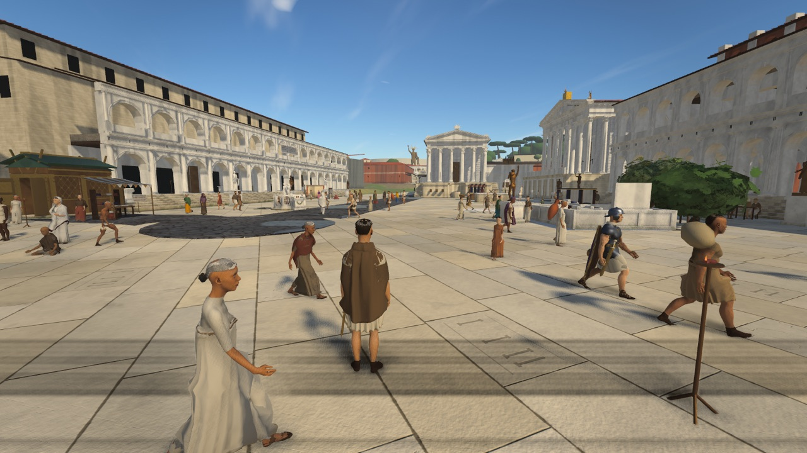

It's built in the spirit of *Skyrim* and *Oblivion*: a city you can walk anywhere in, historical places you can visit, period quests, street fights, gladiators and bosses. The fantasy is turned way down. There are no dragons or fireballs. The "supernatural" is limited to what a Roman would have believed: omens, curse tablets, mystery cults, and the ghost nights of the Lemuria. Nothing is ever clearly real.

The story opens before dawn on 11 May 113 at the Porta Capena. Trajan's Column is to be dedicated tomorrow. The Pantheon is a construction site after the fire of 110. The emperor is preparing to leave for the Parthian war. You arrive with the last night cart, a courier is knifed beside you, and you're left holding his sealed tablet.

> **Status: playable alpha (10 October 2026).**
>
> **You can play:**
> - Act I's four main quests, start to finish: from the ambush at the Porta Capena to the archer on top of Trajan's Column.
> - Eleven side quests and four repeatable jobs.
> - A city that keeps its own hours. Shops open and shut, the baths open at the bell, there are dice in the Subura at night and bets on the games at the Colosseum, and notice boards and rumours change every day.
> - Street fights, the law, and the gladiator bouts at the Ludus Magnus.
> - A minimap and a quest route along the streets.
>
> **Still rough:**
> - The story stops after the Column. Chapter 5, *The Board*, is designed but not built.
> - Nobody speaks aloud. Dialogue is text, and voices are wordless grunts and cries.
> - The Column is the only building you can go inside.
> - NPCs still rub against benches, stalls and statue bases.
> - The game is heavy on memory, and a second performance pass is next.
>
> [Where things stand](#where-things-stand) has the full list.

## Screenshots

| | |
|---|---|
| 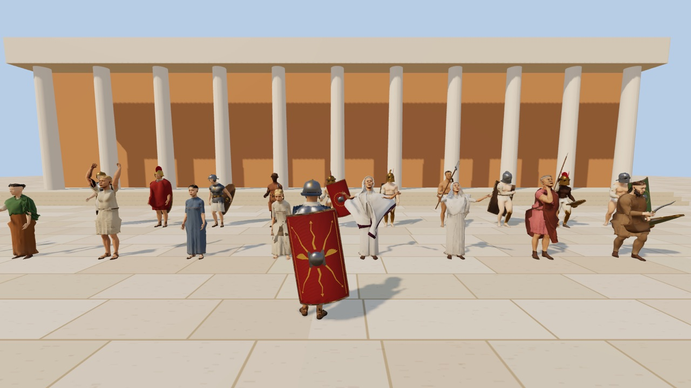 | 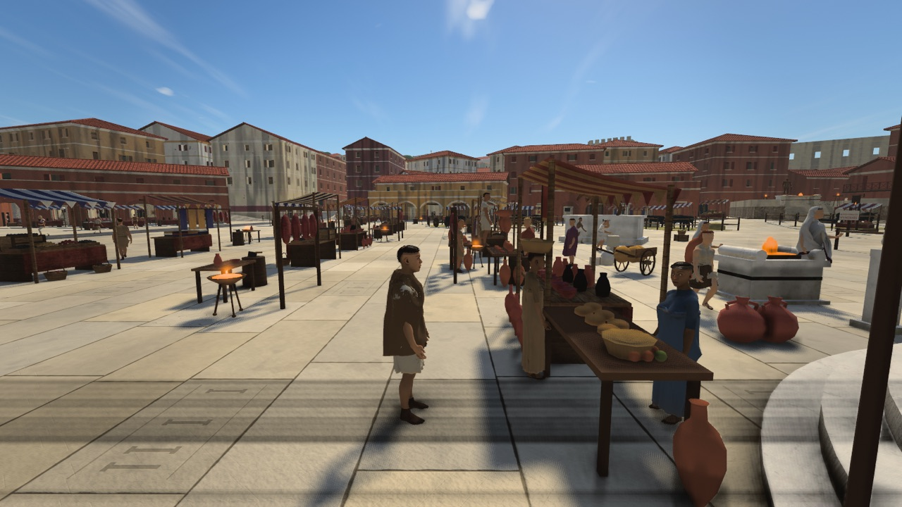 |
| *The cast (`?scene=avatars`): realistic bodies, cloth-simulated togas and stolas, soldiers and gladiators* | *Market day (nundinae) at the Forum Boarium: four extra stalls and cheaper prices* |
| 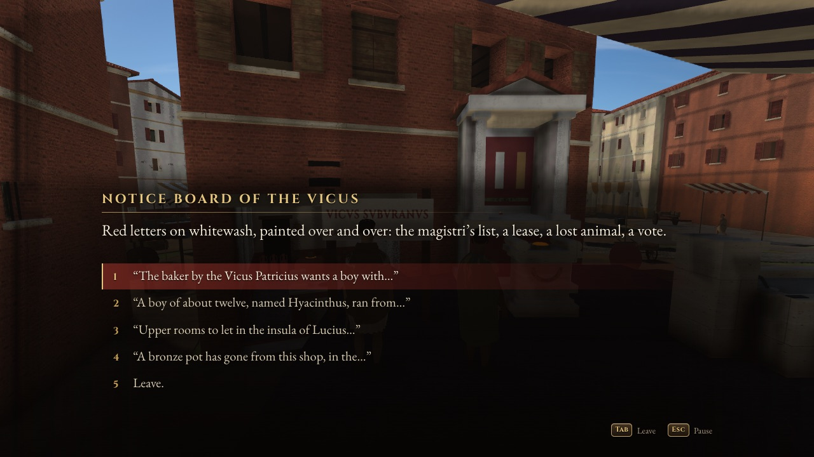 | 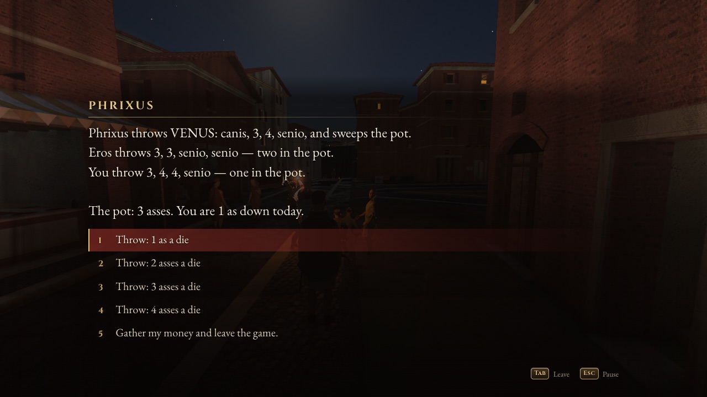 |
| *The Subura's notice board: a lost boy, rooms to let, a stolen bronze pot* | *Knucklebones (tali) in the Subura at night, under Augustus's own rules* |
| 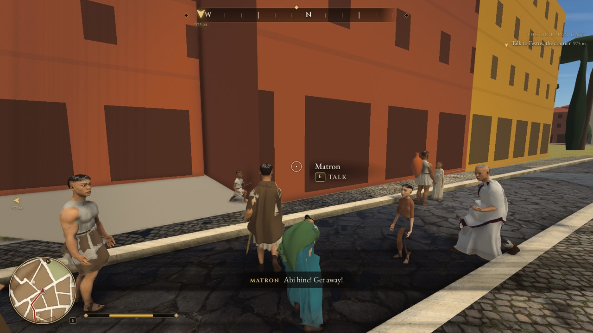 | 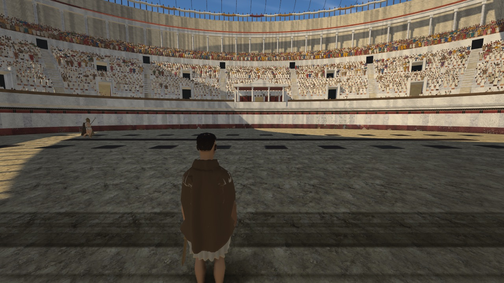 |
| *The minimap (B shows or hides it), the route along the streets, and the compass* | *Inside the Colosseum (Amphitheatrum Flavium) on a games day* |
| 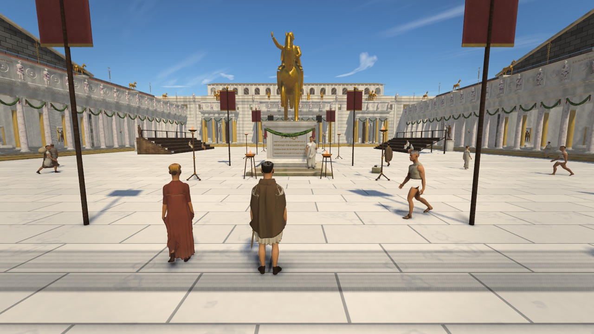 | 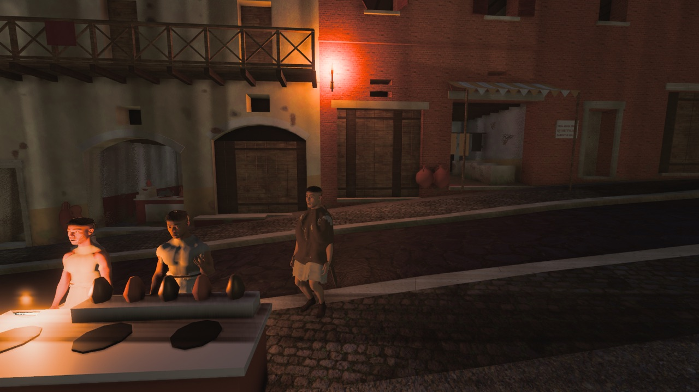 |
| *Trajan's Forum, dressed for the Column's dedication* | *A popina in the Subura at night* |
| 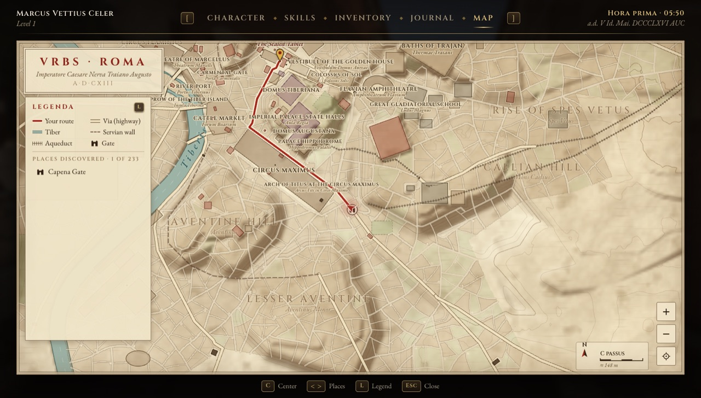 | 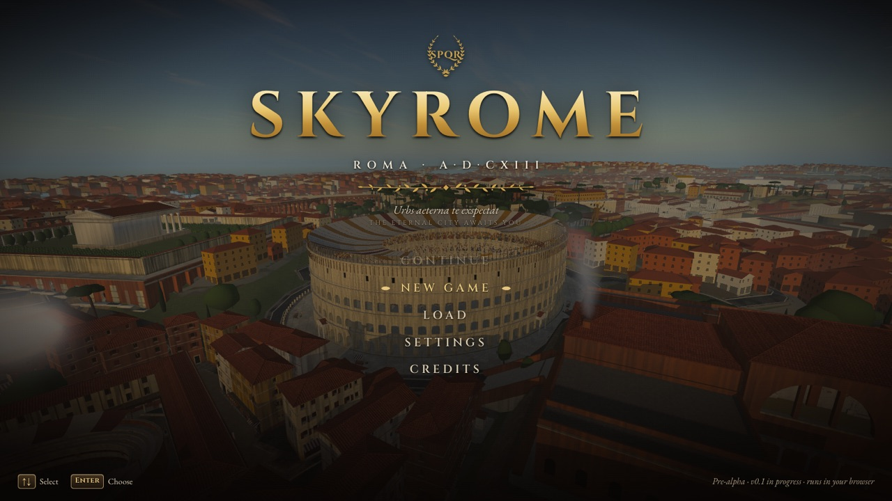 |
| *The map, drawn from the historical atlas, with your route in red* | *The title screen* |

## Play it

**https://scootsmagoo.github.io/skyrome/**

Use desktop Chrome or Safari.

- **The plain link** is the test build. It skips the menus and puts you in the Forum at 10 in the morning on 11 May, with a default character and the opening scene skipped, so you can walk about at once.
- **[`?story=1`](https://scootsmagoo.github.io/skyrome/?story=1)** plays the story from its real opening. It is an hour before dawn, and you ride a wine cart up to the Porta Capena beside a courier who keeps looking back down the road. He starts talking.
- **[`?menu=1`](https://scootsmagoo.github.io/skyrome/?menu=1)** is the full flow. You choose your controls, see the title screen over the live city, make a character, and then the story begins.

In the story, the gold marker and the line under the compass always show your next step. The minimap draws the route along the streets. A banner announces each new objective, and J opens the journal. The story so far is written up in [docs/STORY.md](docs/STORY.md).

- **Look around:** click into the view to capture the mouse, or use the arrow keys. Esc releases it and pauses.
- **Move:** W A S D.
- **Talk, shop, open, use:** E.
- **Fight:** F attacks (hold it for a power attack), Q blocks, R draws your sword.
- **Minimap:** B.
- **Everything else:** see [Controls](#controls).

Every push to `main` redeploys the site once the tests pass. Hard-refresh (Cmd+Shift+R) to get the latest build.

## What you can do

### The story: Act I

There are four chapters, one after the other, over two days. [docs/STORY.md](docs/STORY.md) has the whole thing.

| Chapter | Where and when | What happens |
|---|---|---|
| 1. *The Dripping Gate* | The Porta Capena, 11 May, 04:30 | The night cart. Festus the courier says he is being followed. The ambush, his dying words, and the sealed tablet. |
| 2. *The Sealed Tablet* | The Forum, the Ludus Magnus and the Vicus Tuscus, from dawn to dusk | You meet Chrysippus, keeper of the strongrooms under the Temple of Castor, and Gratus, centurion of the imperial couriers. The trainer Glaucus names the killer. You face the Mouse in a burned taberna and find a Parthian silver coin. At dusk you hand over the tablet, but it is in a cipher. |
| 3. *Beans for the Dead* | The Velabrum, the night of the Lemuria | Festus's parents and the midnight rite for the dead (Ovid, *Fasti* 5). You find his twin Gemellus hiding at Tryphon's bookshop. He gives you the key, the message decodes, and you warn Gratus. |
| 4. *One Hundred Feet* | The Forum of Trajan, 12 May | Gratus's briefing, then the dedication of the Column. An arrow comes from the top. You climb 185 steps of spiral stair past two knife-men and face the archer on the platform. You can spare or kill him. Then Pudens, chief of the couriers, summons you. |

After chapter 4 a banner says *Act I continues*: chapter 5, *The Board* (Pudens's offer on 13 May), is designed but not built yet. The calendar keeps running, and the city stays open to you.

### Side quests and jobs

Side quests are offers. You hear about them from a shopkeeper, a passer-by, the town crier or a painted notice. None of them takes the quest tracker away from the main story, and none of them is offered before the opening chapter is over.

- ***The Oath*** (Ludus Magnus): sign on with Glaucus and fight three practice bouts. The last is against Nereus the retiarius, with his net and trident.
- ***Brawl at the Fountain***: the fans of the murmillones and the thraeces are about to come to blows at the Meta Sudans. Pick a side and fight with your fists only.
- ***Hilara***: a Molossian hound has gone astray, and her owner, Tryphon the barber, will pay to get her back. A sausage helps.
- ***The Bronze Pot***: a coppersmith in the Vicus Tuscus has lost a bronze pot, and he will pay more for the thief.
- ***The Bath Thief***: a cloak a day goes from the pegs at the Baths of Titus. You can confront the thief, report him to the vigiles, or write a curse tablet.
- ***Forged Tokens***: someone is selling false lead tokens for the grain dole at the Porticus Minucia, and the curator wants the mould found, quietly.
- ***Mercury's Water***: on the Ides of May (15 May) the merchants wash their lies away at Mercury's spring by the Porta Capena, and one of them is washing away a real fraud. It comes after the Column.
- ***Free by the God's Hand***: a sick slave named Daos was left on Tiber Island to die. He got up, and now his master's steward wants him back.
- ***Black Beans***, ***The Leaning Insula*** and ***What Venus Hides***: smaller stories about stolen beans for the dead, a cracking tenement, and the drain under the shrine of Venus Cloacina.

**Jobs** can be done again and again for pay:
- carrying amphorae at the river port;
- the Subura bread round;
- delivering a patron's letter;
- a paid practice bout at the Ludus.

### City life

These came in the October "living city" work ([`docs/design/world-life.md`](docs/design/world-life.md)). Shopkeepers and attendants are named people at real stations, and they keep hours.

- **Shops.** About two dozen traders by district:
  - **The Subura:** the popina, the baker, the wine-seller, the smith, the barber and the fuller.
  - **The Forum and the Sacred Way:** a letter-writer, a spice dealer and a pearl-dealer.
  - **The Argiletum:** a bookseller and a cobbler.
  - **The Velabrum and the Vicus Tuscus:** cheese, clothes and oil.
  - **The Circus Maximus:** a cookshop, a potter and a fortune-teller.
  - **The river markets:** a butcher and a greengrocer.

  At night the shutters go down: *Closed · opens at the third hour*. Every eighth day is a market day (*nundinae*). Four extra stalls with banners appear at the Forum Boarium and the Forum Holitorium, and their prices are 10% lower.
- **Services.**
  - **The baths:** the Baths of Titus and the Baths of Trajan open at the bell, the 8th hour, about 1 pm. Tip the cloakroom slave or risk your cloak.
  - **Personal care:** a haircut and shave, laundry and mending, and washing at the street fountains.
  - **Fortunes and readings:** a fortune-teller's lot, an omen reading, or a horoscope.
  - **A bed:** a pallet behind the Silver Pig, with a locked chest for your things.
  - **The morning call** (*salutatio*) at a senator's door on the Velia for the daily dole (*sportula*). You need a toga.
- **News.** There are four notice boards: the Subura crossroads, the Forum, the aediles' board at the Temple of Ceres, and the games wall at the Meta Sudans. The crier Cerdo calls out the news. Townsfolk pass on rumours, and those change daily.
- **Dice.** Knucklebones (*tali*) under Augustus's own rules, as Suetonius records them:
  - a dog (one) or a six pays into the pot;
  - Venus (four different faces) takes it.

  Play Phrixus in the Subura in the evening and at night, or Mnester on the Basilica Julia steps by day. Gambling is tolerated, not legal, so neither will throw while the watch is near.
- **Bets on the games.** At the Colosseum on a games day, buy a programme from Sosibius. Then bet ¼ to 4 denarii with the bookmaker Faustinus on the next pair after the midday interval. A winning bet pays 1.8 times your stake.
- **Crafting.** There is a mortar bench at Demetrius's in the Basilica Aemilia (also called the Basilica Paulli), and another in the Ludus infirmary once you've finished *The Oath*. The bench has seven recipes: bandages, posca, poultices, eye salve, a fever draught, a sleeping draught and theriac.
- **Street life.** When someone cries "Fur!" ("Thief!"), you can run the purse-snatcher down and give the purse back for a small reward. Hawkers sell honey cakes and lupins from their trays.

### Combat and the law

You can attack anyone. Rome answers with bounties, guards and the Carcer. See [Fighting and the law](#fighting-and-the-law).

### Getting around

- **Minimap.** A round GTA-style minimap sits in the bottom-left corner and shows 80 m around you. B shows or hides it. It shows the route, objectives, enemies, tradespeople and quest givers. It can turn with your view or keep north up.
- **Route.** The route to your objective follows the streets on the minimap and the big map (M). There is also an optional trail of gold chevrons on the ground. It is off by default: Esc → Settings → Interface → *Route on the ground*.
- **Compass and marker.** These always point the right way. A target behind you rides the edge of the screen on the side to turn toward. When the objective is inside the Column (or outside it while you're in), they lead you to the door first.

## Testing

### Quick links

| What | Link |
|---|---|
| The plain link: the Forum at 10:00 with the opening scene skipped, for walking about | [scootsmagoo.github.io/skyrome](https://scootsmagoo.github.io/skyrome/) |
| The story from the start: the cart at the Porta Capena, 04:30 | [`?story=1`](https://scootsmagoo.github.io/skyrome/?story=1) |
| The full flow: control presets, title, character creation, then the story | [`?menu=1`](https://scootsmagoo.github.io/skyrome/?menu=1) |
| **Boss fight: Nereus the retiarius** (net, trident, crowd favour, missio) | [`?fight=nereus`](https://scootsmagoo.github.io/skyrome/?fight=nereus) |
| Warm-up bout 1: Pullus, a nervous recruit | [`?fight=pullus`](https://scootsmagoo.github.io/skyrome/?fight=pullus) |
| Warm-up bout 2: Auctus, a thraex who hooks round your shield | [`?fight=auctus`](https://scootsmagoo.github.io/skyrome/?fight=auctus) |
| City life with the opening done (notice boards, jobs and side-quest offers are live): the Forum at 08:30 | [`?part=castor`](https://scootsmagoo.github.io/skyrome/?part=castor) |
| The Subura at night: dice, popinae, lamplit windows | [`?at=subura&hour=21`](https://scootsmagoo.github.io/skyrome/?at=subura&hour=21) |
| The Baths of Titus after the bell | [`?at=baths-titus&hour=14`](https://scootsmagoo.github.io/skyrome/?at=baths-titus&hour=14) |
| The river markets at the Forum Boarium | [`?at=forum-boarium&hour=10`](https://scootsmagoo.github.io/skyrome/?at=forum-boarium&hour=10) |
| The Ludus Magnus on an ordinary day (no fight) | [`?at=ludus-magnus&hour=10`](https://scootsmagoo.github.io/skyrome/?at=ludus-magnus&hour=10) |
| Trajan's Forum and the Column | [`?at=forum-trajan&hour=10`](https://scootsmagoo.github.io/skyrome/?at=forum-trajan&hour=10) |
| The Colosseum at night | [`?at=colosseum&hour=22`](https://scootsmagoo.github.io/skyrome/?at=colosseum&hour=22) |
| The Pantheon (a construction site after the fire of 110) | [`?at=pantheon`](https://scootsmagoo.github.io/skyrome/?at=pantheon) |
| Show the welcome card again | [`?story=1&welcome=1`](https://scootsmagoo.github.io/skyrome/?story=1&welcome=1) |
| Performance overlay (fps, draw calls, CPU per system) | [`?debug`](https://scootsmagoo.github.io/skyrome/?debug) |

Options combine:
- `?at=` takes any landmark id. Type `coc` in the console for the list.
- `&hour=` sets the hour (0–24).
- `&origin=` sets the character's background: `civis-suburanus`, `hispanus`, `veteranus` or `dacus`.
- `&sex=female` plays a woman.

The plain link skips the opening scene but doesn't count it as played. Shops, dice and the baths work there, but the notice boards, jobs and side-quest offers wait until Chapter 1, The Dripping Gate, is finished (the plain link does not finish it; see [the story](docs/STORY.md)). Start from `?part=castor` or any later part to try those.

### Playing the story (needs a human)

A bot plays all four chapters end to end (`node scripts/golden-path.mjs`; its last run, on 10 October 2026, took about 13 minutes). But it can't tell whether something is confusing, ugly, too easy or no fun. Each link below starts one part as if you had played up to it. Follow the gold marker, and note anything that feels wrong.

| Part | Link | What to look for |
|---|---|---|
| 1. The Dripping Gate: the cart, the ambush, the dying courier | [`?story=1`](https://scootsmagoo.github.io/skyrome/?story=1) | Does Festus make you expect trouble? Is it clear why you're attacked, and who ran off? Do his last words tell you where to go? |
| 2. The tablet to the Forum, up the Circus valley | [`?part=city`](https://scootsmagoo.github.io/skyrome/?part=city) | Can you find the way with the marker and the minimap alone? Anywhere you get stuck? |
| 3. The strongrooms of Castor: the keeper and Gratus | [`?part=castor`](https://scootsmagoo.github.io/skyrome/?part=castor) | Does the keeper's caginess make sense? Is it clear why Gratus won't take the tablet yet, and why he sends you to the Ludus? |
| 4. The Ludus Magnus: Glaucus names the killer | [`?part=ludus`](https://scootsmagoo.github.io/skyrome/?part=ludus) | Does Glaucus answer straight? Is the gladiator side quest clearly optional? |
| 5. The Mouse in the burned taberna, and Festus' satchel | [`?part=mouse`](https://scootsmagoo.github.io/skyrome/?part=mouse) | Fight, threaten or talk him round: do all three work? Is the strongbox easy to find? |
| 6. After sunset: the tablet delivered, and the cipher | [`?part=deliver`](https://scootsmagoo.github.io/skyrome/?part=deliver) | Does the twist (a cipher only the twin can read) land? Is it clear where to go next? |
| 7. The Lemuria: the family, the midnight rite, the clues | [`?part=lemuria`](https://scootsmagoo.github.io/skyrome/?part=lemuria) | Does the rite feel eerie? Does T get you to midnight? Are the clues findable? |
| 8. The twin, and the warning to Gratus | [`?part=twin`](https://scootsmagoo.github.io/skyrome/?part=twin) | Does Gemellus's scene make sense? Does "Be in the Forum of Trajan at dawn" lead clearly into chapter 4? |
| 9. The dedication: Gratus' briefing in the Column court, then the ceremony | [`?part=dedication`](https://scootsmagoo.github.io/skyrome/?part=dedication) | Is the plan clear (roofs, gallery, the door)? Does the ceremony read as a scene, and is it clear where to stand? |
| 10. The Column's door is open: the stair and its two knife-men | [`?part=column`](https://scootsmagoo.github.io/skyrome/?part=column) | Does the stair feel like a climb? Is the next landing always on screen? Do the men on the landings fight fair? |
| 11. The top of the stair: the archer on the platform | [`?part=summit`](https://scootsmagoo.github.io/skyrome/?part=summit) | Is the platform readable from the hatch? Does Bitus's yield panel make the choice (spare or kill) clear? |
| 12. After the archer: Gratus in the court, Pudens's summons | [`?part=aftermath`](https://scootsmagoo.github.io/skyrome/?part=aftermath) | Is it clear who to go to next? Does Pudens's omen land, and do Bitus's fate and Gratus's wound read in the scene? Is the "Act I continues" banner a fair place to stop? |
| Side quest: The Oath at the Ludus, then the three bouts | [`?part=oath`](https://scootsmagoo.github.io/skyrome/?part=oath) · [`?fight=nereus`](https://scootsmagoo.github.io/skyrome/?fight=nereus) | Is signing on clear? Too easy or too hard? Is the net readable? |
| Side quest: the brawl at the fountain (fists only) | [`?part=brawl`](https://scootsmagoo.github.io/skyrome/?part=brawl) | Picking a side, then the fistfight. Does drawing a blade (R) warn you? |

**Checks only a person can do**

| Check | Link |
|---|---|
| The full start: control preset, title screen, character creation (4 origins), the Porta Capena before dawn | [`?menu=1`](https://scootsmagoo.github.io/skyrome/?menu=1) |
| Trackpad and keyboard-only play: pick each preset at the start of `?menu=1`, then play part 1 | [`?menu=1`](https://scootsmagoo.github.io/skyrome/?menu=1) |
| Mac input lab: the pointer-lock click never attacks, momentum scrolling never sends a burst of zoom, and a pinch never zooms the page | [`?scene=inputlab`](https://scootsmagoo.github.io/skyrome/?scene=inputlab) |
| Safari: smooth in the Forum (open the console with ` and type `tdo` for the fps) | [`?at=rostra&hour=10`](https://scootsmagoo.github.io/skyrome/?at=rostra&hour=10), in Safari |
| A weaker computer: does Auto pick a sensible quality, and is it playable? (`graphics` in the console) | [the plain link](https://scootsmagoo.github.io/skyrome/), on that computer |
| The crowd's sound: do the murmurs sound like real people near you, with no constant babble? | [the plain link](https://scootsmagoo.github.io/skyrome/) |
| Shops: are they where you'd expect, and is it clear when one is shut? | [`?at=subura&hour=12`](https://scootsmagoo.github.io/skyrome/?at=subura&hour=12) |
| Quest pacing after the opening: do offers come at a comfortable rate, and never pull you off the main story? | [`?part=castor`](https://scootsmagoo.github.io/skyrome/?part=castor) |
| The minimap and the route: readable at a glance, and right at every turn? | [`?part=city`](https://scootsmagoo.github.io/skyrome/?part=city) |

### The console

Press **`** (the key left of 1) to open it, as in Skyrim. The game pauses while it's open.
- Enter runs a command.
- ↑ and ↓ recall earlier ones.
- Tab completes.
- ` or Esc closes it.

Names are fuzzy-matched. Cheats last until you reload the page.

| Command | What it does |
|---|---|
| `tgm` | God mode: no damage, endless stamina (type it again to turn it off) |
| `tcl` | No-clip: fly through walls and floors (Space up, C down, Shift fast) |
| `coc <place>` | Teleport to a landmark: `coc ludus`, `coc colosseum`, `coc forum-romanum` (a short `coc forum` picks the Forum of Nerva). `coc` alone lists them all |
| `fight <name>` | Go to the Ludus and start a bout: `fight nereus`, `fight pullus`, `fight auctus` |
| `munus [next]` | The games in the Colosseum: today's show, or `munus next` to call the next pair now |
| `spawn <enemy> [n]` | Enemies in front of you: `spawn grassator 3` (street thugs), `tiro`, `thraex`, `vigil`, `miles-urbanus` |
| `kill` / `killall` | Kill whoever you're looking at / everyone fighting you |
| `knock` | Knock down whoever you're looking at |
| `heal` | Full health and stamina; cures poison, disease and injuries |
| `additem <item> [n]` | Add an item by id or name: `additem gladius`, `additem scutum`. `items` lists them |
| `gold <n>` | Add denarii |
| `sethour <h>` | Change the time of day (`set gamehour to 20` works too) |
| `life` | The city's life at a glance: shopkeepers open and shut, today's rumours, any problems |
| `life keepers` | Every shopkeeper: open, shut ("opens at …") or dead |
| `life goto <id>` | Stand in front of a shopkeeper or a thing: `life goto vinarius`, `life goto act.subura.board` |
| `life open <id>` | Do what E does on a thing (open a notice board, a dice table, the mortar bench) |
| `life rumours [where]` | Today's rumours, for one board or district, or `talk`, `cry` or `notice` |
| `job` / `job start <id>` | List the jobs / start one: `job start job-portus-saccarius` |
| `clearbounty` | Wipe your bounty; the watch stands down |
| `difficulty <level>` | `tiro`, `facilis`, `normalis` (default), `difficilis`, `herculea` |
| `gore <level>` | `off`, `normal`, `ultra` |
| `graphics [tier]` | Show which graphics card the game found and the tier it chose, or set `auto`, `low`, `medium`, `high` |
| `tdo` | Performance overlay on/off |
| `pos` | Print where you are |
| `help` | Everything above, in the game |

### Things to try

- **Go shopping.** On the plain link, walk north-east from the Forum into the Subura, or type `life goto vinarius`. Press E on a shopkeeper. `life keepers` shows who is open.
- **Take a bath.** Go to [`?at=baths-titus&hour=14`](https://scootsmagoo.github.io/skyrome/?at=baths-titus&hour=14) and talk to the bath-keeper. Choose a plain bath, a tip for the cloakroom slave, or a rub-down.
- **Throw the bones.** Go to [`?at=subura&hour=21`](https://scootsmagoo.github.io/skyrome/?at=subura&hour=21) and find Phrixus (`life goto subura-aleator` if you can't). Stakes are 1 to 4 asses. Throw Venus to take the pot. He won't throw while the watch is near.
- **Grind a remedy.** Find Demetrius's mortar in the Basilica Aemilia, on the Forum. It costs one as to use. You can sell what you make, but the margin is small on purpose.
- **Earn a wage.** From [`?part=castor`](https://scootsmagoo.github.io/skyrome/?part=castor), type `job` to see the jobs. Or go to the river port and ask about carrying amphorae.
- **Bet on the games.** Go to the Colosseum after midday on a games day (`munus` tells you whether today is one). Buy a programme from Sosibius, then bet with Faustinus.
- **Read the boards.** From `?part=castor`, read the notice board in the Forum or at the Subura crossroads. Some notices start side quests. For example, Primus the coppersmith wants his bronze pot back.
- **Street fight.** Open the console, type `spawn grassator 3`, close it, press R to draw and F to swing. Add `tgm` first if you just want to watch the gore.
- **The law.** Hit a passer-by. They flee or fight back, and the watch comes. You can pay, talk, bribe, go to jail or resist. `clearbounty` resets it.
- **The boss.** Go to [`?fight=nereus`](https://scootsmagoo.github.io/skyrome/?fight=nereus).
  - Sidestep when he twirls the net. If it catches you, mash F or E.
  - On the Mouse preset, hold Q to block. On the Trackpad and Keyboard presets, Q toggles block (Esc → Settings → Controls → Blocking). Tap Q just before his blow lands to parry, then strike at once to riposte.
  - Lost? Type `fight nereus` in the console for a rematch.
  - Once you've beaten him the questline is finished, so reload the link to fight him again.
- **Getting around fast.** `tcl` and Shift fly you over the city. `coc` jumps between landmarks.
- **Feel.** Esc → Settings → Gameplay has difficulty, gore, camera shake and hit-stop. Esc → Settings → Interface has the minimap and route options.

## Try it locally

The project's CI uses Node 22, so use that or newer.

```bash
npm install
npm run dev
```

Then open one of these scenes. Click into the game to look around and press Esc to release the mouse.

| Scene | URL | What it shows |
|---|---|---|
| The game | http://127.0.0.1:5173/ | The same as the live site. The plain URL is the Forum at mid-morning. Other options: <ul><li>`?story=1`: the story's opening</li><li>`?menu=1`: the full flow</li><li>`?quick=1`: the agents' quick start at the Porta Capena (nobody talks first)</li><li>`?at=<landmark>`: start there</li></ul> |
| The river district | http://127.0.0.1:5173/?scene=rome&at=temple-portunus | Straight into Rome with no menus, at the Forum Boarium. `at=` takes any of the atlas's 208 landmark ids, e.g. `temple-aesculapius`, `theatre-marcellus`, `circus-maximus`, `column-trajan`, `pantheon` |
| Characters | http://127.0.0.1:5173/?scene=avatars | The cast: bodies, clothes, animation clips, a crowd, first and third person |
| Architecture | http://127.0.0.1:5173/?scene=arch | The classical kit: orders, temples, arches, the amphitheatre arcade, the Column, domes, statues |
| Street | http://127.0.0.1:5173/?scene=fabric | A neighbourhood of insulae, shops, stalls, fountains and trees on sloping ground |
| Sky | http://127.0.0.1:5173/?scene=sky&timelapse=1 | The sky, sun and moon for AD 113, weather and shadows (try `&hour=23`, `&weather=rain`) |
| Interface | http://127.0.0.1:5173/?scene=ui&open=title | HUD and menus filled with sample data (`open=map`, `inventory`, `journal`, `dialogue`…) |
| Sound | http://127.0.0.1:5173/?scene=audio | A sound board: footsteps on each surface, ambience, music states |
| Combat | http://127.0.0.1:5173/?scene=arena | A combat test bed: duels, one against four, Nereus |
| Landmark viewer | http://127.0.0.1:5173/?scene=landmark&id=colosseum&cam=aerial | One landmark on the real terrain, with framed camera views |

Add `&debug` to any URL (or type `tdo` in the console) to show fps, draw calls, position, and the systems costing the most CPU each frame. Every link and console command in [Testing](#testing) works locally too.

The checks the agents run before merging (they need a real browser and a GPU, so they don't run on GitHub):

```bash
npm test                              # Vitest, about 2,500 tests
npm run typecheck
npm run check:controls                # real key presses in Chromium and WebKit, all three presets
node scripts/golden-path.mjs          # a bot plays Act I from the cart to the Column
node scripts/perf-budget.mjs          # fails if a fixed view gets slower or heavier
node scripts/shot.mjs --scene rome --query "at=subura&hour=21"   # a screenshot into .shots/
```

### Slow computer, or a laptop running hot?

The game picks its graphics quality for your computer the first time it starts (**Esc → Settings → Display → Graphics quality: Auto**):

- **High:** Apple M-series Macs and computers with an NVIDIA, AMD or Intel Arc A/B-series graphics card. A machine with 4 or fewer CPU cores drops to Medium.
- **Medium:** the strongest built-in graphics (AMD Radeon 680M/780M/890M, Intel Arc). Lower resolution, cheaper shadows, a shorter view distance and fewer people on the streets.
- **Low:** other built-in graphics (Ryzen 2000–5000 "Radeon Graphics", Intel Iris Xe, UHD and HD), computers with 4 GB of memory or less, and browsers drawing without the graphics card. No shadows or glow, 30 fps.

If the game still stutters, Auto steps down one level by itself and tells you. You can pick a level yourself, or change single rows; your choices stick. The console's `graphics` command shows which graphics card the game found and what it chose. The links [`?graphics=low`](https://scootsmagoo.github.io/skyrome/?graphics=low), `medium` and `high` set a level too, and [`?graphics=auto-reset`](https://scootsmagoo.github.io/skyrome/?graphics=auto-reset) goes back to Auto.

**Still a slideshow?** Open `chrome://gpu` and look for "WebGL: Hardware accelerated". If it says *software* or *disabled*, the browser isn't using your graphics card (work computers sometimes have it turned off), and no setting in the game can make up for that. The game warns you when it detects this.

To make it run cooler and quieter on any machine, set **Frame rate limit** to 30 fps (it roughly halves the work), lower **Render scale**, or turn **Shadows** to Low.

The game also rests when you aren't playing:
- The frame rate is capped at 60 by default.
- The title screen and character creation run at 30 fps.
- While it's paused (menus, dialogue, the console), it redraws only when the view moves.
- When its tab or window is in the background it draws nothing at all.

## Controls

The game is designed to be fully playable on a Mac trackpad, so every mouse action also has a key. Every key can be changed in Esc → Settings → Controls.

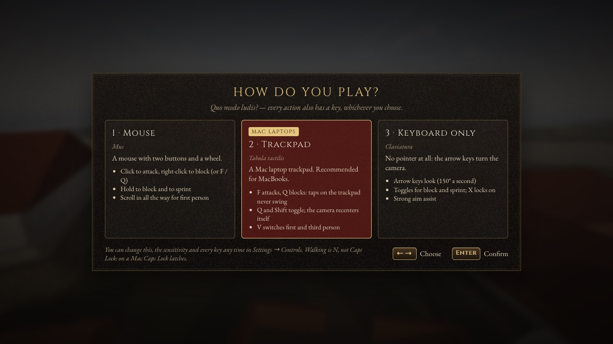

*On first launch (with `?menu=1`) you pick how you play. The trackpad preset is built for MacBooks.*

| Action | Keys |
|---|---|
| Move · sprint · jump | W A S D · Shift (on the Trackpad and Keyboard presets, tap once to sprint until you stop) · Space |
| Climb | Kerbs and low steps (under about 30 cm) you walk over at any angle. Push into a ledge up to waist height to clamber up; Space at a ledge up to chest height mantles onto it |
| Look | Trackpad or mouse (click to capture) · arrow keys |
| Zoom the third-person camera | Scroll, or `=` and `-` |
| First / third person | V (or scroll the third-person camera all the way in) · H swaps the camera's shoulder |
| Attack (hold for a power attack) · block | F or left click (with the weapon sheathed it draws and swings) · Q or right click |
| Dodge | Option (Alt), or Space in a fight with a weapon drawn |
| Lock on to an enemy | X (also on its own when you draw a weapon near one). While locked: X or ← → switch targets, hold X to let go; when your target falls, the lock moves to the next one fighting you |
| Draw or sheathe a weapon · interact · sneak | R · E · C |
| Minimap | B shows or hides it |
| Menus | Tab · I inventory · J journal · M map · K skills · Esc pause |
| Walk · wait | N · T |
| Quicksave · quickload | P or F5 · L or F9 |
| Use an item · quick wheel · invoke your god | 1–8 (healing first) · G · Z |
| Give up a fight (to the watch: the arrest talk) | Hold Y |
| Stuck somewhere? | Esc → I'm stuck |
| Console (testing) | <code>`</code> (left of 1): `tgm` god mode · `tcl` fly through walls · `coc ludus` teleport · `fight nereus` · `life goto <keeper>` · `help` for the rest |
| Check your trackpad and keys | `?scene=inputlab` |

### Fighting and the law

You can attack anyone, anywhere. Your swing turns toward the person nearest where you're aiming and steps in to reach them. Rome answers, as in *Skyrim*:

- **Assault and murder.** Striking someone who wasn't your enemy is assault (a 40-denarius bounty). Killing them is murder (1,000) if anyone saw it.
- **The guards.** Guards nearby fight you. With a bounty on your head, any guard who spots you walks up and says "Stop right there!". You can pay the fine, talk your way out, bribe him, go to the Carcer (days pass), or resist.
- **A murderer** is attacked on sight. Hold **Y** to give yourself up.
- **Theft.** Walking off with a purse you took back from a thief is theft, if anyone sees.

It's bloody. A killing cut with a blade can take off a head, an arm or a leg. Blood sprays, stumps pump and the dead bleed into pools. To tone it down, open **Esc → Settings → Gameplay → Gore** and choose Normal or Off.

Difficulty runs from *Tiro* (easy) through *Normalis* to *Difficilis* (hard) in Settings. The console adds *Facilis* and *Herculea*.

### Keyboard extensions (Vimium and similar)

Extensions like Vimium use plain letter keys on every website: **d** scrolls, **r** reloads, **x** closes the tab, **f** shows link hints. Skyrome keeps keyboard focus on a hidden form field while you play, which makes these extensions pass your keys through to the game. The one exception is **Esc**: Vimium keeps it for itself, as far as we know. Esc still pauses while the mouse is captured, and **Tab** backs out of any menu. To get Esc back everywhere, add the game's address (e.g. `http://127.0.0.1:5173/*`) to the extension's excluded sites.

If a key ever seems dead, open `?scene=inputlab`, press it, and see whether it shows up. For developers, `npm run check:controls -- --extension <path>` runs the controls check with an unpacked extension loaded.

## How it's made

- **Code first, CC0 where it shows.** All of these are generated in TypeScript:
  - the buildings, streets, props and trees;
  - the sky, sun, moon and stars;
  - the map, the interface and its ornaments;
  - hair, beards and faces;
  - all the animation.

  Where photographs or recordings beat code, the game uses public-domain (CC0) material:
  - human bodies from Blender Studio's *Human Base Meshes*;
  - stone, brick, wood and ground textures from Poly Haven and ambientCG;
  - recorded sound effects from Kenney and OpenGameArt;
  - sampled instruments for the music from VSCO 2 Community Edition.

  Some sounds are still synthesized: the voices (wordless effort sounds and cries), the bow and sling, a few instrument stingers, and the fire, wind, cicada and cricket beds. Every source is listed under [Credits](#credits).
- **Bodies and clothes come from a Blender script, not by hand.** `tools/characters` (`npm run characters`) runs Blender 5.1 in batch mode:
  - it re-poses the bodies to the game's bind pose and cuts them down to three levels of detail;
  - it bakes the sculpted detail into normal and ambient-occlusion maps (KTX2);
  - it simulates the toga, palla, stola and cloaks with Blender's cloth solver.

  The game then fits that baked cloth to each person's build. The garment patterns, pins and drape are generated by `tools/characters/garments.py`.
- **History comes first.** The world comes from a historical atlas of Rome c. AD 113 ([`src/data/atlas.ts`](src/data/atlas.ts), with notes in [`docs/ATLAS.md`](docs/ATLAS.md)).
  - It holds 208 landmarks, the hills, the Tiber, roads, the Servian wall, aqueducts, and the 14 Augustan regions.
  - Everything is in real meters and cross-checked against the coordinates of surviving ruins.
  - The game renders it at 0.6 scale so the city stays walkable, while people, doors and steps stay life-size.
  - Anything built after 113 is kept out on purpose: no Arch of Constantine, no Temple of Venus and Roma, no Aurelian Walls.
  - Prices, dice rules, rites and notices cite their ancient sources in the data, for example Suetonius for the dice, Ovid for the Lemuria, and Pompeian painted notices for the boards.
- **It's built by AI agents.** Claude agents (Anthropic) do most of the building; the owner directs the work, plays it and says what feels wrong.
  - **Plans first.** Each big piece of work starts as a written plan in [`docs/design/`](docs/design/), split into named crews. Examples are NAV (the minimap), MOVE (movement), PERF-cpu and PERF-mem.
  - **Separate branches.** Crews work at the same time in separate git worktrees, each in its own directories. Their work merges in waves into a phase branch, then into `main`.
  - **Build, review, fix.** A builder agent writes the code, a separate reviewer agent checks it, and a fixer addresses what the reviewer found, before each merge.
  - **The checks.** They check their work against the real game, not just the unit tests:
    - **Screenshots:** [`scripts/shot.mjs`](scripts/shot.mjs) boots the game headless on the real GPU and saves screenshots that the agent has to look at.
    - **The story bot:** [`scripts/golden-path.mjs`](scripts/golden-path.mjs) plays all of Act I and reports where it snagged.
    - **The performance budget:** [`scripts/perf-budget.mjs`](scripts/perf-budget.mjs) fails when a fixed view gets slower or heavier.
    - **Controls:** `npm run check:controls` presses real keys in Chromium and WebKit.
    - **Memory and stability:** a leak harness and a 30-minute soak bot.
    - **The map:** a crawl of every landmark for geometry faults.
  - **Deploys.** GitHub Actions runs the unit tests and the build on every push to `main` and then deploys. The browser checks above run on the developer's Mac before merging.

### Tech

| | |
|---|---|
| Language and build | TypeScript 7, [Vite](https://vite.dev) 8 |
| Rendering | [three.js](https://threejs.org) r186 (`WebGLRenderer`). Custom sky, fog, terrain and water shaders. Cascaded shadows, ambient occlusion, sun shafts, tone mapping, a reversed depth buffer, and KTX2/Basis textures |
| Physics | [Rapier](https://rapier.rs) 0.21 (WASM): kinematic character controller, heightfield terrain, ragdolls |
| Characters | Blender 5.1 in batch mode (`tools/characters`): glTF bodies with three levels of detail, and baked cloth |
| UI | DOM overlay (HTML and CSS), Cinzel and EB Garamond fonts |
| Audio | Web Audio API: recorded CC0 effects, sampled instruments, and a few synthesized sounds |
| Tests | [Vitest](https://vitest.dev) 5: 2,495 tests in 205 files (2,490 pass and 5 are skipped, as of 10 October 2026). Playwright 1.63 drives the real game in Chromium and WebKit for screenshots, controls, performance and the story bot |
| Targets | Desktop Chrome and Safari on Apple-silicon Macs first. 60 fps, with fewer than about 1,500 draw calls and 3 million triangles in view |

Why the browser and not Unreal or Bethesda's Creation Engine?
- Creation isn't licensable outside Skyrim mods.
- Unreal is editor-driven and built around binary assets, which AI agents can't easily work on.
- The browser lets agents build and test everything as code, and lets anyone play from a link.

The game data and rules are plain TypeScript and could be ported later. [`docs/research/tech.md`](docs/research/tech.md) has the full comparison.

### Repository layout

```
src/
  core/        game loop, input, physics wrapper, events, Roman calendar clock, settings, graphics tiers
  game/        boot, game flow, character creation, story checkpoints, the law
  player/      player controller, climbing, first/third-person camera
  actors/      actors, avatars (realistic bodies, heads, cloth), animation, equipment
  ai/          combat brains; NPC navigation, steering and wall avoidance
  npc/         crowds, daily routines, carts, street barks
  life/        world life: shopkeepers, services, notice boards, rumours, dice and bets, crafting, jobs
  nav/         the quest route on the maps and the ground
  arch/        procedural architecture: classical kit, city fabric, props, vegetation
  gfx/         materials and textures, MeshBuilder, batching and culling, post-processing
  world/       atlas → terrain, landmarks, city, interiors, water, sky and lighting, Rome assembly
  combat/      combat rules, enemy types, gore
  arena/       the Colosseum games and the Ludus bouts
  rpg/         stats, skills and perks, items, factions, crime, barter, combat math
  quests/ dialogue/ content/ save/   engines and content
  ui/          HUD (compass, minimap), menus, dialogue, map, title and loading screens
  audio/       Web Audio engine, sound effects, footsteps, ambience, crowd, music
  dev/         the console, debug overlay, geometry audit
  scenes/      rome (the game) and the dev test beds
  data/        atlas.ts: Rome c. AD 113
public/        bodies and garments (glTF), textures (KTX2), sound and music samples, fonts
tools/         the Blender character and cloth pipeline, the music sample builder
tests/         Vitest tests
docs/          story, GDD, atlas, design plans, module docs, research, credits
scripts/       screenshot driver, story bot, performance budget, leak and soak harnesses, controls and movement checks
```

## Where things stand

Updated 10 October 2026, one week after the first commit. The four main quests of Act I play from start to finish, and the city around them is lived in.

| Area | Status |
|---|---|
| Engine: loop, input (Mac trackpad, keyboard extensions like Vimium), physics, first/third-person camera | ✅ Done |
| Historical atlas, game design document, content bible (NPCs, quests, items) | ✅ Done (the content bible is a first draft) |
| The story: Act I's four chapters, from the Porta Capena to the top of Trajan's Column | ✅ Playable end to end (the bot finishes all four) · 🧪 needs human playtesting |
| Chapter 5, *The Board* (13 May), and Acts II and III | 🚧 Designed, not built |
| Side quests (11) and jobs (4) | 🧪 New, playable, pacing and balance under review |
| City life: about two dozen shops and 4 market-day stalls with hours, baths, barber, laundry, fountains, a pallet and chest, the salutatio, 4 notice boards, the crier, rumours, dice, bets on the games, the mortar bench | 🧪 New, playable, needs play |
| Navigation: compass and quest marker (fixed), minimap, quest route on the maps, optional trail on the ground | ✅ Done |
| Characters: realistic bodies, cloth-simulated togas and cloaks, painted faces that blink and move their jaws as they talk, hair and beards, hands, foot placement on steps and slopes | ✅ Done (the toga front is smoother than real wool; a sprint can show the calf under a long hem) |
| Graphics: sky lighting, cascaded shadows, ambient occlusion, haze, weather from clear to storm, day and night, weathered walls, puddles, travertine paving in the Forum | ✅ Done |
| Sound: recorded effects, footsteps on nine surfaces, crowd murmurs from the people actually near you, birds and insects, sampled music, two ancient tunes as set pieces | ✅ Done, but the crowd murmurs still need a playtest (no spoken dialogue) |
| The city core: Forum, Velia, Colosseum valley, Palatine and Circus, Capitoline and Imperial Fora, river district, Campus Martius, terrain and the Tiber | ✅ Built (detail and density still growing) |
| Across the Tiber: Trastevere's streets and tenements, garden villas up the Janiculum, Trajan's new aqueduct terminal and its mill race with water wheels, the overgrown Naumachia of Augustus | ✅ Built ([`?at=aqua-traiana-terminus`](https://scootsmagoo.github.io/skyrome/?at=aqua-traiana-terminus)) |
| The Vatican plain: the Circus of Gaius and Nero, the imperial gardens, the tombs of the Via Cornelia, the Meta Romuli, Trajan's new naumachia | ✅ Built ([`?at=vatican-necropolis`](https://scootsmagoo.github.io/skyrome/?at=vatican-necropolis)) |
| Interiors | ✅ Trajan's Column (vestibule, chamber, stair, platform) · 🚧 nothing else yet |
| Combat: light chains, power attacks, block/parry/riposte, dodge, lock-on, aim assist; attack anyone | ✅ Done |
| Gore: blood, and severed heads and limbs (Settings → Gameplay → Gore) | ✅ Done |
| Crime and the watch: assault and murder bounties, guards, the arrest talk, the Carcer | ✅ Done |
| The Ludus Magnus bouts with Nereus the retiarius (the first boss) | 🧪 Playable, balance under review |
| Crowds with daily life, street muggers at night | ✅ Done (some NPCs still get stuck: they re-plan around walls now, but still rub against benches, stalls and statue bases) |
| Movement: you stay planted on slopes and step up kerbs at an angle | ✅ Done (two steep banks still catch you) |
| Performance: a budget gate, quiet menus and pause, fewer hitches, a faster boot | ✅ Passes on the developer's M4 Max · 🚧 a second pass is next (phase 3) |
| Memory: four leaks fixed, the 30-minute soak passes | ✅ No known leaks · 🚧 still about 800 MB of heap in the Forum, to shrink next |
| Trackpad, Safari and weaker computers | 🧪 Need a human |

Measured on the developer's M4 Max ([`docs/research/perf-audit-2026-10.md`](docs/research/perf-audit-2026-10.md)), the October performance pass did the following:
- **Render submit** (the time to hand a frame to the GPU) fell by a third on High (Forum 9.9 → 6.8 ms) and by 40% on Medium.
- **Hitches:** frames over 33 ms in the Forum fell from 22 to 4–5.
- **Boot** got 5–7 seconds shorter: about 14–15 s to the first frame on a quiet machine.

[`docs/research/memory-audit-2026-10.md`](docs/research/memory-audit-2026-10.md) has the memory numbers.

## Roadmap

The full plan is in the [Game Design Document](docs/GDD.md) (§17–§18). The version names are milestones, not releases: `package.json` still says 0.0.1.

| Version | Name | Highlights | Where it is |
|---|---|---|---|
| v0.0 | *Prima Lux-alpha* | The Forum, the Velia and the Colosseum valley. Street fights and the Ludus Magnus arena with the first boss (Nereus the retiarius). First and third person. Quicksave | ✅ Done |
| v0.1 | *Prima Lux* | The whole Rome core (Capitoline, Palatine, the Imperial Fora with Trajan's Forum, Circus Maximus, Forum Boarium, Tiber Island). Character creation, crowds with daily schedules, 4 quests, vendors, inventory, journal, map, saves, day and night. The "golden path" | ✅ Largely in: the four quests, the core, vendors and the rest are playable. **← now: playtesting and polish** |
| v0.2 | *Columna* | Act I of the main quest complete. The Cloaca Maxima and the Carcer. Crime and bounty, stealth, lockpicking, pickpocketing, all 10 origins | 🚧 Partly: the Column chapter, crime and bounty are in. Four of the ten origins are playable (the other six are shown locked). Chapter 5 and the rest of Act I come next |
| v0.3 | *Vigiliae* | The Subura and the Caelian. The Vigiles (fire brigade) and Urban Cohorts questlines. Fires and rooftops | The Subura's streets, shops and dice are in; the questlines are not |
| v0.4 | *Harena* | The Colosseum interior and hypogeum, the full gladiator career, chariot racing in the Circus | Games and betting at the Colosseum are in, seen from outside; the interior is not |
| v0.5 | *Urbs* | The whole city as one streamed world: Campus Martius, the Baths of Trajan over Nero's buried Golden House, the Aventine, Trastevere | The whole city already streams as one world; filling it in continues |
| v0.6–v0.8 | *Coniuratio*, *Profectio*, *Plenitudo* | Acts II and III of the main quest (a conspiracy as Trajan departs for Parthia), more faction lines, density passes | Not started |
| v1.0 | *Roma* | Rome complete | |
| Later | | Ostia and Trajan's new harbor at Portus, the Via Appia and the Alban Hills, Tibur, then the provinces | |

What comes next, in order:
1. **A playtest** of the city life and the side quests.
2. **Phase 3**, a second performance pass: shrinking memory, a cheaper city draw, and the soak bot learning to survive dying.
3. **Chapter 5, *The Board*.**

## Documentation

- [`docs/STORY.md`](docs/STORY.md): the story as played, chapter by chapter, and the rules it keeps. It wins where other docs disagree
- [`docs/GDD.md`](docs/GDD.md): the game design document: setting, systems, combat numbers, quests, world plan, acceptance criteria
- [`docs/CONTENT.md`](docs/CONTENT.md): the content bible: NPCs, quests, items, enemies and in-world texts
- [`docs/ATLAS.md`](docs/ATLAS.md) and [`docs/atlas.svg`](docs/atlas.svg): the historical map data and a rendered plan of it
- [`docs/design/`](docs/design/): the plans the agents worked from:
  - the October rework of graphics, audio, map and physics;
  - the living city;
  - world life (shops, services, crafting, dice, jobs, side quests);
  - chapter 4 at the Column.
- [`docs/ARCHITECTURE.md`](docs/ARCHITECTURE.md) and [`docs/modules/`](docs/modules/): code structure and per-module notes (life, nav, movement, interiors, avatar-real and the rest)
- [`docs/research/`](docs/research/): research on topography, landmarks, architecture, Roman society and trades, game design, tech, assets, and the October performance and memory audits
- [`docs/credits/`](docs/credits/): sources and licences in detail
- [`CLAUDE.md`](CLAUDE.md): conventions and commands for the AI agents (and humans) working on the code

## Credits

**Bodies.** [Human Base Meshes](https://studio.blender.org/projects/human-base-meshes/) bundle v1.4.1 by Blender Studio (Blender Foundation), CC0 1.0.
- The game uses the objects `GEO-body_male_realistic` and `GEO-body_female_realistic`.
- Their sculpted detail is baked into the normal and ambient-occlusion maps.
- See [`public/models/people/CREDITS.md`](public/models/people/CREDITS.md).

**Garments.** Made for Skyrome with Blender 5.1's cloth solver (`tools/characters/garments.py`), and released as CC0 1.0. No third-party garment model or texture is used. See [`public/models/garments/CREDITS.md`](public/models/garments/CREDITS.md).

**Textures** (CC0). Full list in [`docs/credits/classical.md`](docs/credits/classical.md).
- **[Poly Haven](https://polyhaven.com):**
  - rock_face (Greg Zaal, Dario Barresi)
  - stone_wall_03 (eye-candy.xyz)
  - weathered_brown_planks (Dimitrios Savva, Rico Cilliers)
  - old_wood_floor (Guillaume Monsergent)
  - grey_stone_path (Amal Kumar)
  - cobblestone_floor_04, sand_01 and brown_mud_02 (Rob Tuytel)
  - gravel_floor (Jenelle van Heerden, Matterfield)
  - dirt, grass_ground and withered_grass (Charlotte Baglioni)
  - pine_bark (Dimitrios Savva)
- **[ambientCG](https://ambientcg.com)** by Lennart Demes:
  - Marble001 and Marble012
  - Rock049 and Rock050
  - Concrete025
  - Bricks094
  - Plaster001
  - RoofingTiles006
  - PavingStones126A

**Sound effects** (CC0). These were cut, filtered and layered by `scripts/sfx/build.mjs`. Full list in [`public/audio/sfx/CREDITS.md`](public/audio/sfx/CREDITS.md).
- **[Kenney](https://www.kenney.nl):** Impact Sounds, RPG Audio and Interface Sounds.
- **[OpenGameArt](https://opengameart.org):**
  - *Different steps on wood, stone, leaves, gravel and mud* (kdd)
  - *Fantozzi's Footsteps (Grass/Sand & Stone)* (Fantozzi)
  - *Footsteps (leather, cloth, armor)*
  - *Fantasy Weapons and Apparel SFX Library* (WolfTech / vehiclemusic.eu)
  - *20 Sword Sound Effects* (StarNinjas)
  - *3 melee sounds* (qubodup / Iwan Gabovitch, edited by remaxim)
  - *Swishes Sound Pack*
  - *RPG Sound Pack* (artisticdude)
  - *100 CC0 SFX #2*
  - *Crowd Shouting/Speaking Ambience*
  - *Ambient Bird Sounds* (isaiah658)
  - *Water Splash and sand footsteps*

**Music samples.** [VSCO 2 Community Edition](http://vis.versilstudios.net/vsco-community.html) ([GitHub](https://github.com/sgossner/VSCO-2-CE)), CC0 1.0.
- Credit goes to Versilian Studios / Sam Gossner and Ivy Audio / Simon Dalzell. Sample cutting was by Elan Hickler / Soundemote.
- The game uses a 56-file subset: harp, oboe, flute, cello section, a large hand drum, muted hand drums and tambourine.
- See [`public/audio/music/CREDITS.md`](public/audio/music/CREDITS.md).

**Ancient music.** The notes of the *Epitaph of Seikilos* (1st century AD) and the *First Delphic Hymn to Apollo* (c. 128 BC) come from public-domain MIDI files on Wikimedia Commons. The Delphic Hymn file is by User:Rnabet. The arrangements are the game's own.

**Fonts.** [Cinzel](https://github.com/NDISCOVER/Cinzel) by Natanael Gama and [EB Garamond](https://github.com/octaviopardo/EBGaramond12) by Georg Duffner and Octavio Pardo. Both are under the SIL Open Font License 1.1 ([`public/fonts/`](public/fonts/)).

**Libraries.**
- three.js (MIT), including its FXAA shader, SunLight helpers and BufferGeometryUtils.
- Rapier (Apache-2.0).
- *Hash without Sine* by Dave Hoskins (MIT).

**Research the code builds on.**
- The sky follows Hillaire's atmosphere model (EGSR 2020), bloom follows Jimenez (SIGGRAPH 2014), and the sun and moon follow Meeus's *Astronomical Algorithms*.
- The stars come from the Yale Bright Star Catalogue.
- The synthesized sounds use Karplus–Strong strings, Klatt formants and the RBJ filter cookbook.
- Details are in [`docs/credits/`](docs/credits/).

**Latin quotations.** From Juvenal, Tacitus, Virgil, Horace, Ovid, Terence, Martial, Suetonius and Pliny the Younger (public domain). The translations are the project's own.

Skyrome is a fan-made, independent project. It is not affiliated with or endorsed by Bethesda Softworks, ZeniMax or Microsoft. *The Elder Scrolls* and *Skyrim* are their trademarks, and they're mentioned here only to describe the genre.

## License

The code is released under the [MIT License](LICENSE). Third-party assets keep their own licenses: the bodies, textures, sound effects and music samples are CC0, and the fonts are under the SIL Open Font License 1.1 (see [Credits](#credits) and [`docs/credits/`](docs/credits/)).
