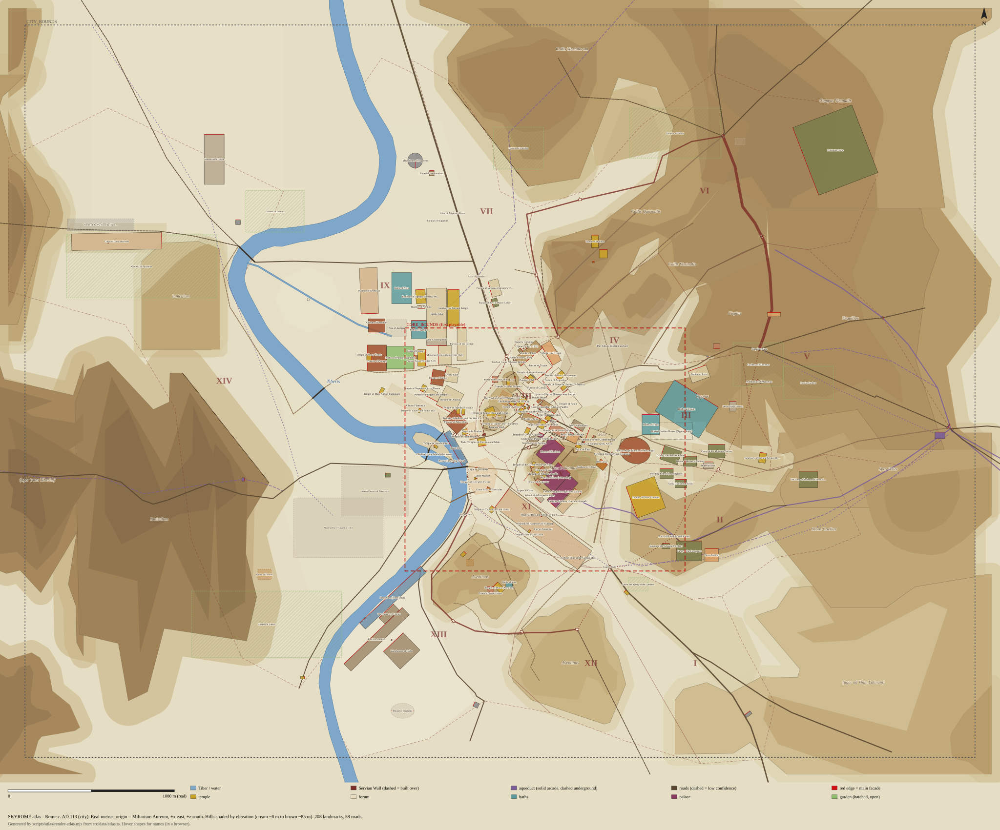

# SKYROME world atlas

`src/data/atlas.ts` holds Rome in spring–summer AD 113 as plain data: terrain, the Tiber, streets, the Servian Wall, gates, aqueducts, bridges, the 14 regions and 208 landmarks. It has no imports, so it can be used in the game, in tests, in Node scripts or after a move to another engine. `docs/atlas.svg` is the overview map drawn from it.



## Frame and conventions

- **Units.** Real metres. The game multiplies by `WORLD_SCALE = 0.6` both horizontally and vertically (`src/world/coords.ts`). Human-scale details stay 1:1.
- **Origin.** The Miliarium Aureum at lat 41.892580, lon 12.484380 (OSM way 131557543).
  - `x = (lon − lon0) · 111320 · cos(lat0)`, which is about `(lon − lon0) · 82866.4`. +x is east.
  - `z = −(lat − lat0) · 110574`. +z is south.
- **Elevations.** Metres above sea level at the **ancient** (AD 113) ground level. Valley floors lie 5–15 m below today's streets.
- **Landmark `rotation`.** The compass bearing, clockwise from north, that the main facade faces. In the local frame the facade faces −z and `w` runs along x; for Three.js, `object.rotation.y = −rotation·π/180`.
  - **rect:** `w` is the width across the facade and `d` is the depth from front to back.
  - **ellipse:** `rx` is the long semi-axis, so `rotation = long-axis bearing − 90`. Example: the Colosseum's axis is 109°, so its rotation is 19.
  - **circle:** `rotation` is the bearing the door faces (Vesta faces 90 = E).
  - **Theatres and odea:** the "facade" is the curved cavea and the stage is the back side. The rect is the cavea plus the stage block, and `builderNotes` gives the orchestra centre.
  - **Circuses and stadia:** the facade is the straight (carceres) end and the curved end is at the back. For example, the Circus Maximus has rotation 307 (carceres face WNW).
  - **Fora:** `rotation` is the way the main temple or entrance faces. Augustus 230 (Mars Ultor faces SW), Caesar 131, Nerva 230, Templum Pacis 321, Trajan 140 (entrance SE).
- **Optional landmark fields** (added to the required schema):
  - `siting`:
    - `pad` (the default): flatten a pad at `baseElevation`.
    - `slope`: terraced into a hillside. Don't flatten; use `groundAt`. Examples: Markets of Trajan, Tabularium, Domus Augustana.
    - `open`: square, garden, district or water. Raise no solid mass.
    - `underground`: buried, such as the Domus Aurea wing.
  - `within`: the landmark nested inside this one, for example Mars Ultor in the Forum of Augustus.
  - `statusNote`: a free-text qualifier for the status.
  - `codexNote`: an **out-of-world** note for the codex or map, holding modern or later facts that no Roman of 113 could know (what a site became, later anecdotes, modern labels). Examples: the Stadium "survives as Piazza Navona", and Constantius II and Trajan's horse (AD 357).
- **In-world vs out-of-world text.**
  - `description` holds only what a Roman of 113 could know or believe, so it can reach the player and NPCs.
  - `builderNotes`, `notes`, `codexNote` and FLAGs are for builders and the codex. Never voice them in dialogue.
  - **Regions** are known only by number in 113 ("the Fourth Region"). `Region.latin` is `'Regio IV'` and so on. `Region.name` (Templum Pacis, Isis et Serapis…) is the 4th-century Regionary name, kept as a map label only (Platner & Ashby, *Regiones Quattuordecim*).
  - Latin names that are later than 113 carry a marker: `(medieval name)`, `(later: Pincius)`, `(modern term: …)`. In-world, the Pincian is the *Collis Hortulorum*, "the Hill of Gardens".
- **Other optional fields:**
  - Hills have `kind: 'hill' | 'terrace'` (see below), `parent` and `confidence`.
  - Gates have `landmarkId`. When it is set, the gate is also built as a landmark, so wall builders should skip it.
  - Walls have `rampartWidth` (the agger).
  - Bridges have `length` and `notes`.
  - Most arrays carry `confidence`: `high` is surveyed remains (±5–15 m), `medium` is ±20–40 m, and `low` is a best guess (±50–150 m).
- **`LOWLANDS` order matters.** The terrain blend applies them in sequence, so general areas come first and specific depressions after.

## Coverage

| Export | Count | Notes |
|---|---|---|
| HILLS | 57 | **21 named hills** (the research outlines plus the Asylum saddle, Castra Praetoria plateau, Janiculum N spur, Monteverde, Via Latina plateau and Spes Vetus rise) and **36 `terrace` helpers**. Terraces are higher (or outer) contours of the research DEM. Without them the `max()` dome model sat 5–45 m low on the plateaus and the NE was missing entirely. Fit against the section-4 DEM: RMS **15.8 m → 6.5 m** city-wide and **5.4 m** in the core, where river cells and deliberate cliffs dominate the residual. |
| LOWLANDS | 26 | Research polygons, with the Subura split into lower and upper parts. Added: Velia N slope, the Labicana valley (three steps), the Appia valley, the Sallustian valley (two parts), Tarentum, the N Campus and the Vatican-circus terrace. |
| RIVERS | 2 | **Tiber:** 109 points, 80 of them inside CITY_BOUNDS. The city part is the OSM bank midline sampled every 50 m, widened by +5 m (+10 m in the Campus), with one band across **both** branches of Tiber Island. **Euripus** canal (low confidence). |
| ISLANDS | 1 | Tiber Island: the OSM outline inset 8 m (no modern quays). |
| ROADS | 58 | 31 from the research (several rerouted) and 27 added. The added ones are OSM lines of modern streets on ancient courses (Via Caelimontana, S. Gregorio, the Circus-side streets, the Aventine streets, the Labicana), reconstructed stairs (Scalae Caci, Centum Gradus, Gradus Monetae) and three short bridgehead links (the Tiber Island street, Pons Agrippae to the riverside road, Pons Sublicius to the Via Portuensis). Every core bridge end now meets a road. |
| WALLS / GATES | 9 / 20 | Servian circuit split into stretches by 113 state: agger and Aventine `partial`, most stretches `built-over`, Trajan's cut `height 0`. 17 Servian gates plus Mugonia, Romanula and Triumphalis. |
| AQUEDUCTS | 12 | Claudia + Anio Novus, Arcus Neroniani, Domitian's Palatine branch, Marcia/Tepula/Julia, Julia branch, Rivus Herculaneus, Virgo, Traiana (AD 109) + Janiculum mill-race, Appia, Anio Vetus, Alsietina (schematic). |
| BRIDGES | 7 | Mulvius, Neronianus, Agrippae, Fabricius, Cestius, Aemilius, Sublicius (timber, `arches: 0`). No Pons Aelius. |
| REGIONS | 14 | Augustan regiones I–XIV. density and wealth are 0–1, mapped from the research 1–5 scale. `latin` is the number only (`Regio IV`). `name` is the later (4th-century) Regionary name, a map label only. |
| LANDMARKS | 208 | **173 of 184** gazetteer rows; the other 11 are bridges, linear features and the island, which live in their own arrays. **35 added** from the gazetteer notes and the terrain doc: Venus Cloacina, Volcanal, Jupiter Tonans, island prow and obelisk, Columna Bellica, Campus Sceleratus, Tarentum altar, Pliny's house, the Arch of Augustus over the Via Tiburtina, and others. By priority: P1 96, P2 69, P3 43. Every P1 footprint touches CORE_BOUNDS. |
| CORE_BOUNDS | x −720…960, z −480…980 | About 1.7 × 1.5 km real. Covers the Capitoline, Forum, Palatine, Colosseum valley with the Ludus Magnus and the W edge of the Baths of Trajan, the Imperial Fora with Trajan's Forum and Markets, the S Subura, the Circus Maximus to the Porta Capena, the Velabrum, Forum Boarium and Holitorium, Tiber Island and the Theatre of Marcellus. |
| CITY_BOUNDS | x −3000…2700, z −2300…2100 | Vatican circus to Porta Maggiore; Pincian and Castra Praetoria to Testaccio, the Pyramid of Cestius and the Tomb of the Scipios. |

## Sources

- **`docs/research/topography-terrain.md`:** frame, hills, the DEM (Aldrete 2007 fig. 1.6 georeferenced, plus TINITALY), control points, Tiber, streets, wall, aqueducts and regions.
- **`docs/research/topography-landmarks.md`:** the gazetteer. Descriptions and builder notes are taken from it.
- **`docs/research/architecture.md`:** heights and dimensions.
- **OpenStreetMap (ODbL), Overpass, 2026-10-03:**
  - Used to check footprints and orientations by oriented box or area-moment fit. These cover the Castor podium (axis 25/205), Colosseum (109°), Circus Maximus park (127°), Pantheon (N), Trajan's Column and Equus (140°), Forum of Nerva, Markets, Domus Flavia and Augustana, Pyramid edges (24/114) and the Arch of Dolabella (way 135618677).
  - Also used for the street lines.
  - Used in the review pass for:
    - Via Claudia (the Claudianum's E side) and Via di Grotta Pinta (circle fit to the cavea of Pompey's theatre);
    - the Domus Tiberiana (rel 1860920) and Casa di Livia (rel 1860919) polygons;
    - the Baths of Trajan wall and exedra remains;
    - the Trajan's Forum and Markets polygons;
    - the Clivo di Scauro and Via di S. Paolo della Croce.
- **Reference works:**
  - Platner & Ashby (LacusCurtius), Richardson, Coarelli and Wikipedia, as cited in the research files.
  - The review pass also used Platner on Thermae Traiani, Thermae Titi, Forum Holitorium, Lacus Orphei and Regiones; the Sovrintendenza Capitolina page on the Terme di Traiano; Plutarch, *Galba* 24; Pliny, *NH* 12.94; Suetonius, *Aug.* 91; and Ammianus 16.10.

## Decisions that differ from the research text

- **Temple of Castor faces ~25° (NNE)**, parallel to the Basilica Julia front, per the OSM podium. It does not face NW, and the "N/NW" in `architecture.md` is approximate.
- **Pyramid of Cestius:** rotation 294 (its edges run 24°/114°), not 315.
- **Basilica Ulpia:** the long axis runs NE–SW (50/230) and the facade faces the square at 140.
- **Trajan's complex axis is 140°**, the line through the Column and the Equus base (gazetteer: 143).
- **Circus Maximus:**
  - The axis is 127°, fitted to the OSM park outline; the terrain doc derived 120°.
  - Centre (110, 728), with the carceres at about (−138, 541).
- **Moved positions:**
  - Arch of Dolabella to (895, 771), the surviving arch (OSM). The earlier (858, 790) was the church of S. Tommaso in Formis. The gate, the Via Caelimontana, the Arcus Neroniani and the Servian Wall vertex moved with it.
  - Porta Carmentalis to (−245, 162), the terrain team's B position.
  - Atrium Vestae, Domus Augustana, Baths of Agrippa and a few C-rated sites, to remove overlaps.
- **Review pass (2026-10-03):**
  - **Baths of Trajan:**
    - The footprint is now the peribolos: centre (970, 7), 310 × 220 m, rotation 32. The rotation follows the remains of the SW wall at 121–123°; Platner gives 30.
    - Its SW side runs between the two library exedrae (OSM, ~(795, 5) and ~(1050, 158)).
    - The theatre hemicycle projects ~80 m beyond the rect over the Domus Aurea, so builders must add it.
    - The old rect crossed the Clivus Suburanus and left no room for the Porticus Liviae. That porticus now sits between the street and the baths, at (1045, −203).
    - A reviewer proposed a 340 × 330 rect at (980, 38). It was not used, because it would have put the SW library exedra on the NW side.
  - **Baths of Titus:** (755, 100), facade N, 105 × 120 m, following Platner. They sit just W of the Trajan peribolos.
  - **Ludus Dacicus:** moved to (990, 320), E of the Ludus Magnus.
  - **Temple of Divus Claudius:**
    - The platform is turned to follow the Via Claudia: centre (725, 537), rotation 250 (WSW), 200 × 180 m.
    - The Arcus Neroniani now end S of the platform, and the Palatine branch starts there.
    - The Ludus Matutinus moved to (850, 395) and the Ludus Gallicus to (935, 455).
  - **Theatre of Pompey:** the orchestra is (−867, −297), from a circle fit to Grotta Pinta, so the theatre centre is (−888, −300). Venus Victrix is at (−935, −301). The Porticus Pompeiana runs from (−748, −302) for 165 m, ending at the Curia front.
  - **Domus Tiberiana:** (152, 262), rotation 40, 110 × 140 m. This is the OSM parallelogram, which earlier lay at 90° to the right axis. The Clivus Victoriae now passes below its N corner.
  - **Forum of Trajan and Markets:**
    - The forum is 120 m wide between the portico back walls, and its exedrae project outside the rect.
    - The Markets rect is the block behind the Hemicycle, centre (158, −330) and 137 × 60 m.
    - The Hemicycle front and the forum's NE exedra sit in the strip between the two rects.
  - **Smaller changes:**
    - House of Livia: rotation 312, 24 × 40 m (long axis 132°).
    - Domus Augustana: (226, 502), 72 m wide.
    - Porticus Minucia Frumentaria: (−480, −318), 112 m.
    - Diribitorium: (−530, −392), 34 m deep.
    - Temple of Divus Augustus: (14, 140), W of the Vicus Tuscus.
    - Lacus Orphei (1095, −308) and Domus Plinii (1150, −372): N of the Clivus Suburanus, in Regio V as the Regionaries list it.
  - **River clearance:**
    - The Via Ostiensis, the Lungara riverside road, the Pons Neronianus right end, the Pons Sublicius ends, the riverside Servian stretch and a Forum Boarium vertex no longer sit in the Tiber polygon.
    - The Pons Neronianus is 138 m between the widened atlas banks.
  - **Region tags:**
    - Forum Holitorium, its three temples and the Columna Lactaria are in Regio IX (Platner).
    - The Isis sanctuary on the Via Labicana is in Regio III, and the Regio III polygon now reaches it.
    - Castra Priora Equitum Singularium is in Regio II, and the II/V border now follows the Via Labicana.
- **Rerouted roads:**
  - The **Via Ostiensis** had run over the Aventine river cliff.
  - The **Via Cornelia** had run down the spina of the Vatican circus.
- **Capitolium outline:** pushed about 20 m N so the temple podium sits on the plateau, and an **Asylum saddle** hill was added (about 37 m).
- **Lowland order:** the appendix put `campus-martius` after `campus-martius-central`, which erased the depression; the order is fixed.
- **Janiculum north terraces:** clipped to x < −1830, because the DEM is contaminated E of the Lungara and was raising the Tarentum bank to about 30 m.

## Known uncertainties (flagged in the data)

- **Unlocated buildings** (`confidence: 'low'`), placed by best guess:
  - In the Forum and on the Palatine: Temple of Divus Augustus, Janus Geminus, Lupercal, Pulvinar.
  - Around the Colosseum and on the Caelian: the ludi (Dacicus, Matutinus, Gallicus), Castra Misenatium, Moneta, Macellum Magnum.
  - In the Campus Martius: Porticus Minucia, Diribitorium, Divorum, Porticus Vipsania, the Circus Flaminius temples.
  - On the Aventine and Quirinal: the Aventine temples, Privata Traiani, Thermae Suranae, Temple of Quirinus, Templum Gentis Flaviae.
  - Beyond the river: the naumachiae.
  - Also: Pons Sublicius, the minor Servian gates, and the Colossus spot.
- **Facings that are guesses:** Saturn (NE), the Capitolium (SSE ±15°), Apollo Palatinus, Magna Mater, Templum Pacis, Veiovis, Juno Moneta, Sant'Omobono, the Iseum, and the Castra Praetoria main gate. Treat these as art direction that can be flipped later.
- **State in 113** is uncertain for:
  - the Pantheon (burned shell vs. early works) and the Basilica of Neptune;
  - the Naumachia Augusti, the Diribitorium and the Velia vestibule;
  - the Insula Aracoeli (may postdate 113) and the Umbilicus (the surviving drum is Severan).
- **Heights:** most temple heights are estimates from column proportions. The Capitolium (35 m) is the most doubtful. Monte Testaccio's size in 113 is unknown.
- **Terrain:**
  - The hills are a smooth dome-and-slope model; real cliffs live in `cliffs`.
  - Where `baseElevation` disagrees with the model, the model is the less precise of the two. The Baths of Titus terrace is about +10 m above the model, which is correct: it is an artificial terrace.
  - For exact ground, sample the section-4 grids in the terrain research.
- **Footprint overlaps by design:**
  - The imperial fora meet each other (Nerva against Augustus, the Basilica Aemilia and the Forum of Caesar).
  - The exedrae of Trajan's Forum and the Hemicycle of the Markets lie outside both rects, in the strip between them.
  - The Trajan baths' theatre hemicycle lies outside its rect, SW over the Domus Aurea.
  - Theatre rects include empty corners around the round cavea.
  - Nested landmarks are marked with `within`.
- **People:**
  - Pliny the Younger is governing Bithynia-Pontus and probably dies there c. 112–113.
  - Martial left Rome c. 98 and died c. 102–104.
  - Neither may appear as a living NPC in Rome. Their quest hooks are the shut-up Domus Plinii and an old copy of Martial's Book 10.

## Re-rendering the map

Run these commands from the repo root (Node 22 or later):

```sh
node --experimental-strip-types scripts/atlas/render-atlas.mjs                       # whole city -> docs/atlas.svg
node --experimental-strip-types scripts/atlas/render-atlas.mjs --view core --out /tmp/core.svg
node --experimental-strip-types scripts/atlas/render-atlas.mjs --bounds -270,-200,380,240 --scale 2.6 --out /tmp/forum.svg
```

How the map is drawn:

- **Facades:** the thick red edge of each rect or ellipse is its main facade, and circles get a red door tick.
- **Gardens and open areas:** gardens are hatched; open areas are dashed.
- **Terrain:** hills are shaded by elevation, and dashed brown lines are cliffs.
- **Other elements:** regions are dashed maroon outlines with Roman numerals, and CORE_BOUNDS is the dashed red rectangle.

Hovering a shape in a browser shows its name. To get a PNG, use Playwright (`page.setContent(svg)` then a screenshot) or `qlmanage -t -s 2400 docs/atlas.svg`.

The generator scripts that built the file in one pass are not in the repo. **Edit `atlas.ts` directly from now on**, then re-render and check the map.
